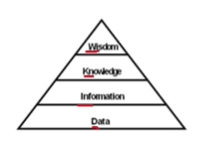
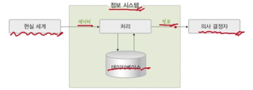
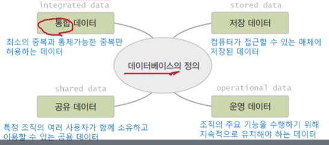

# 01. 데이터베이스 기본 개념

## 📌 데이터베이스의 필요성

### 💡 데이터와 정보

- **데이터(data)**
  - 현실 세계에서 단순히 관찰하거나 측정해 수집한 사실이나 값
- **정보(information)**
  - 의사 결정에 유용하게 활용할 수 있도록 데이터를 처리한 결과물

### 💡 정보 처리 (information processing)

- 데이터에서 정보를 추출하는 과정 또는 방법

### 💡 정보 시스템과 데이터베이스

- **정보 시스템(information system)**

  - 조직 운영에 필요한 데이터를 수집하여 저장해두었다가 필요할 때 유용한 정보를 만들어 주는 수단

- **데이터베이스**

  - 정보 시스템 안에서 데이터를 저장하고 있다가 필요할 때 제공하는 역할을 담당

  

## 📌 데이터베이스의 정의와 특성

### 💡 데이터베이스란 ?

1. 여러가지 업무에 공동으로 필요한 데이터를 유기적으로 결합하여 저장한 집합체. 데이터를 효율적으로 처리하기 위하여 개발된 것으로, 같은 데이터가 중복되는 문제를 없앨 수 있으며 업무가 확대되어도 새로 파일을 준비할 필요가 없다는 장점이 있다.
2. 여러 사람이 공유하여 사용할 목적으로, 통합하여 관리되는 데이터의 집합. 자료 항목의 중복을 없애고 자료를 구조화하여 저장함으로써 자료 검색과 갱신의 효율을 높인다.
3. 여러 사람들이 공유하고 사용할 목적으로 통합 관리되는 정보의 집합이다. 논리적으로 연관된 하나 이상의 자료의 모음으로 그 내용을 고도로 구조화함으로써 검색과 갱신의 효율화를 꾀한 것이다. 즉, 몇 개의 자료 파일을 조직적으로 통합하여 자료 항목의 중복을 없애고 자료를 구조화하여 기억시켜 놓은 자료의 집합체라고 할 수 있다.

### 💡 데이터베이스 (DB;DataBase)

- 특정 조직의 여러 사용자가 **공유**하여 사용할 수 있도록 **통합**해서 **저장**한 **운영** 데이터의 집합

### 💡 데이터베이스의 특성

1. **실시간 접근 (real-time accessibility)**
   - 사용자의 데이터 요구에 실시간으로 응답
2. **계속 변화 (continuos evolution)**
   - 데이터의 계속적인 삽입. 삭제. 수정을 통해 현재의 정확한 데이터를 유지
   - 예) 사원의 입사, 퇴사에 따른 변화를 반영
3. **내용 기반 참조 (contents reference)**
   - 데이터가 저장된 주소나 위치가 아닌 내용으로 참조
   - 예) 연봉이 5000만원 이상이며 과장급 이상인 사원을 검색하시오.
4. **동시 공유 (concurrent sharing)**
   - 서로 다른 데이터의 동시 사용뿐만 아니라 같은 데이터의 동시 사용도 지원