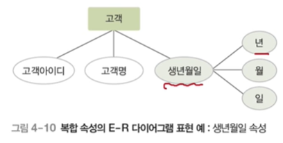
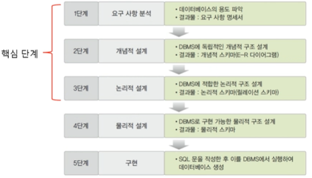

# 04. 데이터 모델링

## 📌 데이터베이스 설계 단계

### 💡 데이터베이스 설계

- 사용자의 다양한 요구 사항을 고려하여 데이터베이스를 생성하는 과정
- E-R 모델과 릴레이션 반환 규칙을 이용한 설계의 과정

### 💡 E-R 모델과 릴레이션 변환 규칙을 이용한 설계의 과정

## 📌 데이터 모델링과 데이터 모델의 개념

### 💡 데이터 모델링 (data modeling)

- 현실 세계에 존재하는 데이터를 컴퓨터 세계의 데이터베이스로 옮기는 변환 과정
- 데이터베이스 설계의 핵심 과정

### 💡 2단계 데이터 모델링

- **개념적 데이터 모델링 (conceptual modeling)**
  - 현실 세계의 중요 데이터를 추출하여 개념 세계로 옮기는 작업
- **논리적 데이터 모델링 (logical modeling)**
  - 개념 세계의 데이터를 데이터베이스에 저장하는 구조로 표현하는 작업

### 💡 데이터 모델 (data model)

- 데이터 모델링의 결과물을 표현하는 도구
- **개념적 데이터 모델**
  - 사람의 머리로 이해할 수 있도록 현실 세계를 개념적 모델링하여 데이터베이스의 개념적 구조로 표현하는 도구
  - 예) 개체-관계 모델
- **논리적 데이터 모델**
  - 개념적 구조를 논리적으로 모델링하여 데이터베이스의 논리적 구조로 표현하는 도구
  - 예) 관계 데이터 모델

### 💡 개체-관계 모델 (E-R model; Entity-Relationship model)

- 피터 첸이 제안한 개념적 데이터 모델
- 개체와 개체 간의 관계를 이용해 현실 세계를 개념적 구조로 표현
- 핵심 요소 : 개체, 속성, 관계

### 💡 개체-관계 다이어그램 (E-R diagram)

- E-R 다이어그램
- 개체-관계 모델을 이용해 현실 세계를 개념적으로 모델링한 결과물을 그림으로 표현한 것

### 💡 개체 (entity)

- 현실 세계에서 조직을 운영하는 데 꼭 필요한 사람이나 사물과 같이 구별되는 모든 것
- 저장할 가치가 있는 중요 데이터를 가지고 있는 사람이나 사물, 개념, 사건 등
- 다른 개체와 구별되는 이름을 가지고 있고, 각 개체만의 고유한 특성이나 상태, 즉 속성을 하나 이상 가지고 있음
- 예) 서점에 필요한 개체 : 고객, 책
- 예) 학교에 필요한 개체: 학과, 과목
- 파일 구조의 레코드 (record) 와 대응됨
- E-R 다이어그램에서 사각형으로 표현하고 사각형 안에 이름을 표기

### 💡 속성 (attribute)

- 개체나 관계가 가지고 있는 고유의 특성
- 의미 있는 데이터의 가장 작은 논리적 단위
- 파일 구조의 필드 (field) 와 대응됨
- E-R 다이어그램에서 타원으로 표현하고 타원 안에 이름을 표기

### 💡 개체 타입 (entity type)

- 개체를 고유의 이름과 속성들로 정의한 것
- 파일 구조의 레코드 타입 (record type) 에 댕ㅇ됨

### 💡 개체 인스턴스 (entity instance) 

- 개체를 구성하고 있는 속성이 실제 값을 가짐으로써 실체화된 개체
- 개체 어커런스 (entity occurrence) 라고도 함
- 파일 구조의 레코드 인스턴스 (record instance) 에 대응됨

### 💡 개체 집합 (entity set)

- 특정 개체 타입에 대한 개체 인스턴스들을 모아놓은 것

### 💡 속성의 분류

## 📌 개체-관계 모델

### 💡 단일 값 속성과 다중 값 속성

- **단일 값 속성 (single-valued attribute)**
  - 값을 하나만 가질 수 있는 속성
  - 예) 고객 개체의 이름, 적립금 속성
- **다중 값 속성 (multi-valued attribute)**
  - 값을 여러 개 가질 수 있는 속성
  - 예) 고객 개체의 연락처 속성
  - 예) 책 개체의 저자 속성
  - E-R 다이어그램에서 이중 타원으로 표현

### 💡 단순 속성과 복합 속성

- **단순 속성 (simple attribute)**
  - 의미를 더는 분해할 수 없는 속성
  - 예) 고객 개체의 적립금 속성
  - 예) 책 개체의 이름, ISBN, 가격 속성
- **복합 속성 (composite attribute)**
  - 의미를 분해할 수 있는 속성
  - 예) 고객 개체의 주소 속성
    - 도, 시, 동, 우편번호 등으로 의미 세분화 가능
  - 예) 고객 개체의 생년월일 속성
    - 연, 월, 일로 의미를 세분화할 수 있음

### 💡 유도 속성 (derived attribute)

- 기존의 다른 속성의 값에서 유도되어 결정되는 속성
- 값이 별도로 저장되지 않음
- 예) 책 개체의 가격과 할인율 속성으로 계산되는 판매가격 속성
- 예) 고객 개체의 출생연도 속성으로 계산되는 나이 속성
- E-R 다이어그램에서 점선 타원으로 표현

### 💡 널 속성 (null attribute)

- 널 값이 허용되는 속성

### 💡 널 (null) 값

- 아직 결정되지 않거나 모르는 값 또는 존재하지 않는 값
- 공백이나 0과는 의미가 다름
- 예) 등급 속성이 널 값 → 아직 등급이 결정되지 않았음을 의미

### 💡 키 속성 (key attribute)

- 각 개체 인스턴스를 식별하는 데 사용되는 속성
- 모든 개체 인스턴스의 키 속성 값이 다름
- 둘 이상의 속성들로 구성되기도 함
- 예) 고객 개체의 고객 아이디 속성
- E-R 다이어그램에서 밑줄로 표현

### 💡 관계 (relationship)

- 개체와 개체가 맺고 있는 의미 있는 연관성
- 개체 집합들 사이의 대응 관계, 즉 매핑 (mapping) 을 의미
- 예) 고객 개체와 책 개체 간의 구매 관계
  - "고객은 책을 구매한다"
- E-R 다이어그램에서 마름모로 표현

### 💡 관계의 유형 

- 관계에 참여하는 개체 타입의 수 기준

1. **이항 관계** : 개체 타입 두 개가 맺는 관계
2. **삼항 관계** : 개체 타입 세 개가 맺는 관계
3. **순환 관계** : 개체 타입 하나가 자기 자신과 맺는 관게

### 💡 관계의 유형

- 매핑 카디널리티 기준

1. **일대일(1:1) 관계**
2. **일대다(1:n) 관계**
3. **다대다(n:m) 관계**

### 💡 매핑 카디널리티 (mapping cardinality)

- 관계를 맺는 두 개체의 집합에서, 각 개체 인스턴스가 연관성을 맺고 있는 상대 개체 집합의 인스턴스 개수

### 💡 일대일 (1:1) 관계

- 개체 A의 각 개체 인스턴스가 개체 B의 개체 인스턴스 **하나**와 관계를 맺을 수 있고, 개체 B의 각 개체 인스턴스도 개체 A의 개체 인스턴스 **하나**와 관계를 맺을 수 있음

### 💡 일대다(1:n) 관계

- 개체 A의 각 개체 인스턴스가 개체 B의 개체 인스턴스 **여러 개**와 관계를 맺을 수 있지만, 개체 B의 각 개체 인스턴스는 개체 A의 개체 인스턴스 **하나**와 관계를 맺을 수 있음

### 💡 다대다(n:m) 관계

- 개체 A의 각 개체 인스턴스가 개체 B의 개체 인스턴스 **여러 개**와 관계를 맺을 수 있고, 개체 B의 각 개체 인스턴스도 개체 A의 개체 인스턴스 **여러 개**와 관계를 맺을 수 있음

### 💡 관계의 참여 특성

- **필수적 참여 (전체 참여)**
  - 모든 개체 인스턴스가 관계에 반드시 참여해야 하는 것을 의미
  - 예) 고객 개체가 책 개체와의 구매 관계에 필수적으로 참여
    - 모든 고객은 책을 반드시 구매해야 함
  - **ERD 에서 이중선으로 표현**
- **선택적 참여 (부분 참여)**
  - 개체 인스턴스 중 일부만 관계에 참여해도 되는 것을 의미
  - 예) 책 개체가 고객 개체와의 구매 관계에 선택적으로 참여
    - 고객이 구매하지 않은 책이 존재할 수 있음

### 💡 관계의 종속성

- **약한 개체 (weak entity)**
  - 다른 개체의 존재 여부에 의존적인 개체
- **오너 개체 (owner entity)**
  - 다른 개체의 존재 여부를 결정하는 개체
- 오너 개체와 약한 개체는 일반적으로 **일대다의 관계**를 가지고, 약한 개체는 오너 개체와의 관계에 **필수적**으로 참여하는 특징이 있음
- 약한 개체는 **오너 개체의 키를 포함하여 키를 구성**하는 특징이 있음
- ERD 에서 약한 개체는 이중 사각형으로 표현하고 약한 개체가 오너 개체와 맺는 관계는 이중 마름모로 표현

### 💡 개체-관계 다이어그램

- 사각형 : 개체를 표현
- 마름모 : 관계를 표현
- 타원 : 속성을 표현
- 링크(연결선) : 각 요소를 연결
- 레이블 : 일대일, 일대다, 다대다 관계

---

# 04. 실습

## 📌 데이터베이스 설계 단계

## 📌 요구사항 분석

### 💡 설계 1단계 : 요구 사항 분석

- **목적**
  - 사용자의 요구 사항을 수집하고 분석하여 개발할 데이터베이스의 용도를 파악
  - 업무에 필요한 데이터가 무엇인지, 그 데이터에 어떤 처리가 필요한지 등을 고려
- **결과물**
  - 요구 사항 명세서
- **주요 작업**
  - 데이터베이스를 실제로 사용할 주요 사용자의 범위를 결정
  - 사용자가 조직에서 수행하는 업무를 분석
  - 면담, 설문 조사, 업무 관련 문서 분석 등의 방법을 이용해 요구 사항 수집
  - 수집된 요구 사항에 대한 분석 결과를 요구 사항 명세서로 작성

## 📌 개념적 설계

### 💡 설계 2단계 : 개념적 설계

- **목적**
  - DBMS 에 독립적인 개념적 스키마 설계
  - 요구 사항 분석 결과물을 개념적 데이터 모델을 이용해 개념적 구조로 표현 → 개념적 모델링
- **결과물**
  - 개념적 스키마 : ERD
- **주요 작업**
  - 요구 사항 분석 결과를 기반으로 중요한 개체를 추출하고 개체 간의 관계를 결정하여 ERD로 표현

- **작업 과정**

  1. 개체 추출, 각 개체의 주요 속성과 키 속성 선별

  2. 개체 간의 관계 설정

  3. ERD로 표현

     