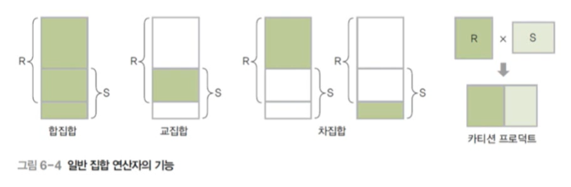

# 07. 관계 데이터 연산

## 📌 관계 데이터 연산의 개념

### 💡 데이터 모델 

= 데이터 구조 + 연산 + 제약 조건

### 💡 관계 데이터 연산 (relational data operation)

- 관계 데이터 모델의 연산
- 원하는 데이터를 얻기 위해 릴레이션에 필요한 처리 요구를 수행하는 것
- 관계 대수와 관계 해석이 있음
  - 기능과 표현력 측면에서 능력이 동등함
  - 처리 절차를 얼마나 자세히 기술하느냐에 따라 차이를 보임

## 📌 관계 대수

### 💡 관계 대수 (relational algebra)의 개념

- 원하는 결과를 얻기 위해 릴레이션의 처리 과정을 순서대로 기술하는 언어
  - 절차 언어 (procedural language)
- 릴레이션을 처리하는 연산자들의 모임
  - 대표 연산자 8개
  - 일반 집합 연산자와 순수 관계 연산자로 분류됨
- 폐쇄 특성 (closure property) 이 존재함
  - 피연산자도 릴레이션이고 연산의 결과도 릴레이션임

### 💡 일반 집합 연산자 (set operation)

- 릴레이션이 튜플의 집합이라는 개념을 이용하는 연산자

- 일반 집합 연산자의 기능

  

  

### 💡 순수 관계 연산자 (relational operation)

- 릴레이션의 구조와 특성을 이용하는 연산자

- 순수 관계 연산자의 기능

  

### 💡 일반 집합 연산자의 특성

- 피연산자가 두 개 필요함
  - 두 개의 릴레이션을 대상으로 연산을 수행
- 합집합, 교집합, 차집합은 피연산자인 두 릴레이션이 합병이 가능해야 함
  - 합병 가능 (union-compatible) 조건
    - 두 릴레이션의 차수가 같아야 함
    - 두 릴레이션에서 서로 대응되는 속성의 도메인이 같아야 함

### 💡 일반 집합 연산자 - 합집합 (union)

- 합병 가능한 두 릴레이션 R과 S의 합집합 : R∪S

  - 릴레이션 R에 속하거나 릴레이션 S에 속하는 모든 튜플로 결과 릴레이션 구성

- 결과 릴레이션의 특성

  - 차수는 릴레이션 R과 S의 차수와 같음
  - 카디널리티는 릴레이션 R과 S의 카디널리티를 더한 것과 같거나 적어짐

- 교환적 특징이 있음

  - R∪S = S∪R

- 결합적 특징이 있음

  - (R∪S)∪T = R∪(S∪T)

  

### 💡 일반 집합 연산자 - 교집합 (intersection)

- 합병 가능한 두 릴레이션 R과 S의 교집합 : R ∩ S
  - 릴레이션 R과 릴레이션 S에 속하는 모든 튜플로 결과 릴레이션 구성
- 결과 릴레이션의 특성
  - 차수는 릴레이션 R과 S의 차수와 같음
  - 카디널리티는 릴레이션 R과 S의 어떤 카디널리티보다 크지 않음
- 교환적 특징이 있음
  - R ∩ S = S ∩ R
- 결합적 특징이 있음
  - (R ∩ S) ∩ T = R ∩ ( S ∩ T)

### 💡 일반 집합 연산자 - 차집합 (difference)

- 합병 가능한 두 릴레이션 R과 S의 차집합 : R-S
  - 릴레이션 R에는 존재하고 릴레이션 S에는 존재하지 않는 튜플로 결과 릴레이션 구성
- 결과 릴레이션의 특성
  - 차수는 릴레이션 R과 S의 차수와 같음
  - R-S의 카디널리티는 릴레이션 R의 카디널리티와 같거나 적음
  - S-R의 카디널리티는 릴레이션 S의 카디널리티와 같거나 적음
- 교환적, 결합적 특징이 없음

### 💡 일반 집합 연산자 - 카티션 프로덕트 (cartesian product)

- 두 릴레이션 R과 S의 카티션 프로덕트 R x S
  - 릴레이션 R에 속한 각 튜플과 릴레이션 S에 속한 각 튜플을 모두 연결하여 만들어진 새로운 튜플로 결과 릴레이션 구성
- 결과 릴레이션의 특성
  - 차수는 릴레이션 R과 S의 차수를 더한 것과 같음
  - 카디널리티는 릴레이션 R과 S의 카디널리티를 곱한 것과 같음
- 교환적 특징이 있음
  - R x S = S x R
- 결합적 특징이 있음
  - (R x S) x T = R x (S x T)

### 💡 순수 관계 연산자 - 셀렉트 (select)

- 릴레이션에서 조건을 만족하는 튜플만 선택하여 결과 릴레이션을 구성
- 하나의 릴레이션을 대상으로 연산을 수행
- 수학적 표현법 : 

- 데이터 언어적 표현법 : 릴레이션 where 조건식
- 조건식
  - 비교식, 프레디킷(predicate) 이라고도 함
  - 속성과 상수의 비교나 속성들 간의 비교로 표현
  - 비교연산자와 논리연산자를 이용해 작성

- 교환적 특징이 있음

### 💡 순수 관계 연산자 - 프로젝트 (project)

- 릴레이션에서 선택한 속성의 값으로 결과 릴레이션을 구성

- 하나의 릴레이션을 대상으로 연산을 수행
- 수학적 표현법 : 

- 데이터 언어적 표현법 : 릴레이션 [속성리스트]

### 💡 순수 관계 연산자 - 조인 (join)

- 조인 속성을 이용해 두 릴레이션을 조합하여 결과 릴레이션을 구성
  - 조인 속성의 값이 같은 튜플만 연결하여 생성된 튜플을 결과 릴레이션에 포함
  - 조인 속성 : 두 릴레이션이 공통으로 가지고 있는 속성
- 표현법 : 

- 자연 조인 (natural join) 이라고도 함
  - 표현법 : 

### 💡 순수 관계 연산자 - 디비전 (division)

- 표현법 : 릴레이션 1 ÷ 릴레이션 2
- 릴레이션2의 모든 튜플과 관련이 있는 릴레이션1의 튜플로 결과 릴레이션을 구성
  - 단, 릴레이션 1이 릴레이션 2의 모든 속성을 포함하고 있어야 연산이 가능함