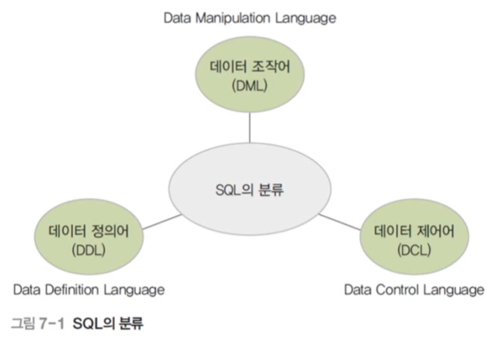

# 08. 데이터베이스 언어 SQL

## 📌 SQL 소개

### 💡 SQL (Structured Query Langauge)

- 관계 데이터베이스를 위한 표준 질의어
- 1974년에 IBM 연구소에서 데이터베이스 시스템, "시스템  R" 을 질의하기 위해서 만들어진 구조화된 언어
- 미국 표준 연구소인 ANSI와 국제 표준화 기구인 ISO 에서 표준화 작업을 진행
  - 1999년 SQL-99(SQL3) 까지 표준화 작업이 완료된 후 계속 수정 및 보완되고 있음

### 💡 SQL의 분류

- 데이터 정의어 (DDL)
  - 테이블을 생성하고 변경, 제거하는 기능을 제공
- 데이터 조작어 (DML)
  - 테이블에 새 데이터를 삽입하거나, 테이블에 저장된 데이터를 수정, 삭제, 검색 하는 기능을 제공
- 데이터 제어어 (DCL)
  - 보안을 위해 데이터에 대한 접근 및 사용 권한을 사용자별로 부여하거나 취소하는 기능을 제공

## 📌 SQL 을 이용한 데이터 정의

### 💡 SQL의 데이터 정의 기능

- 테이블을 생성, 변경, 제거

  

  

### 💡 테이블 생성 : CREATE TABLE 문

- `[]`의 내용은 생략이 가능
- SQL 질의문은 세미콜론`(;)` 으로 문장의 끝을 표시
- SQL 질의문은 대소문자를 구분하지 않음

1. 테이블을 구성하는 각 속성의 이름, 데이터 타입, 기본 제약 사항 정의
2. 기본키 정의
3. 대체키 정의 (Microsift Access SQL로 작동하지 않음)
4. 외래키 정의
5. 데이터 무결성을 위한 제약조건 정의 (Microsift Access SQL로 작동하지 않음)

- 속성의 정의

  - 테이블을 구성하는 각 속성의 데이터 타입을 선택한 다음 널 값 허용 여부와 기본 값 필요 여부를 결정

  - NOT NULL

    - `속성이 널 값을 허용하지 않음을 의미하는 키워드`

    - `예) 고객아이디 VARCAHR(20) NOT NULL`

  - DEFAULT (Microsift Access SQL로 작동하지 않음)

    - 속성의 기본 값을 지정하는 키워드
    - 예) `적립금 INT DEFAULT 0`
    - 예) `담당자 VARCHAR(10) DEFAULT '방경아'`

- 키의 정의
  - PRIMARY KEY
    - 기본키를 지정하는 키워드
    - 예) `PRIMARY KEY(고객아이디)`
    - 예) `PRIMARY KEY(주문 고객, 주문 제품)`
  - UNIQUE (Microsift Access SQL로 작동하지 않음)
    - 대체키를 지정하는 키워드
    - 대체키로 지정되는 속성의 값은 유일성을 가지며, 기본키와 달리 널 값이 허용됨
    - 예) `UNIQUE(고객이름)`
  - FOREIGN KEY
    - 외래키를 지정하는 키워드
    - 외래키가 어떤 테이블의 무슨 속성을 참조하는지 REFERENCES 키워드 다음에 제시
    - 예) `FOREIGN KEY(소속부서) REFERENCES 부서(부서번호)`

- 데이커 무결성 제약조건의 정의
  - CHECK (Microsift Access SQL로 작동하지 않음)
    - 테이블에 정확하고 유효한 데이터를 유지하기 위해 특정 속성에 대한 제약조건을 지정
    - CONSTRAINT 키워드와 함께 고유의 이름을 부여할 수도 있음
    - 예)  `CHECK(재고량 >= 0 worhfid <= 10000)`
    - 예) `CONSTRAINT CHK_CPY CHECK(제조업체='한빛제과')`

### 💡 데이터 변경 : ALTER TABLE 문

- 새로운 속성 추가

  

- 기존 속성 삭제

  

  - CASCADE
    - 삭제할 속성과 관련된 제약조건이나 참조하는 다른 속성을 함께 삭제
  - RESTRICT
    - 삭제할 속성과 관련된 제약조건이나 참조하는 다른 속성이 존재하면 삭제 거부

### 💡 테이블 제거 : DROP TABLE 문

- CASCADE
  - 제거할 테이블을 참조하는 다른 테이블도 함께 제거
- RESTRICT
  - 제거할 테이블을 참조하는 다른 테이블이 존재하면 제거 거부

## 📌 SQL을 이용한 데이터 조작

