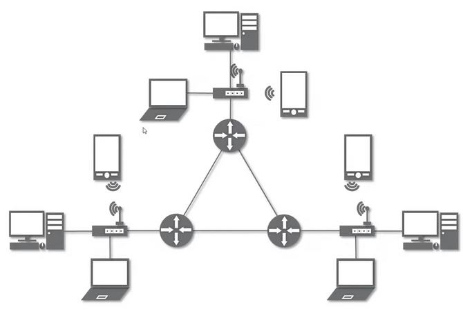
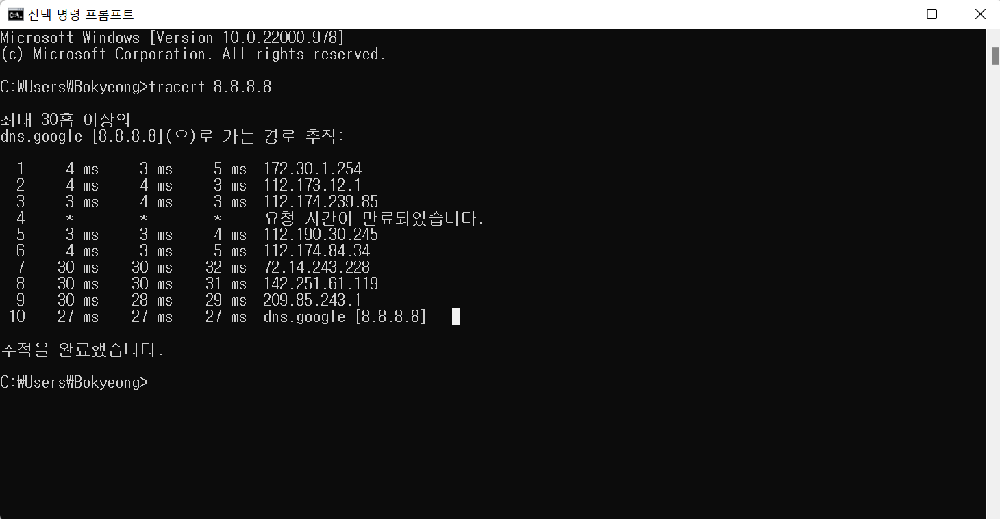

# 01. 네트워크란 무엇인가 ?

#### 📌 네트워크

- 노드들이 데이터를 공유할 수 있게 하는 디지털 전기 통신망의 하나
  - 노드 : 컴퓨터 + 통신장비
- 분산되어 있는 컴퓨터(노드)를 통신망으로 연결 → 서로에게 데이터를 교환

#### 📌 인터넷

- 데이터를 공유하도록 구성된 **세상에서 가장 큰 전세계를 연결하는 네트워크**
  - www (≠인터넷) : 인터넷을 통한 웹 서비스 (데이터 공유)

### 💡 네트워크 분류

#### 📌 크기에 따른 분류

- `LAN`, `WAN`, `MAN`, `VLAN`, `CAN`, `PAN` ...
- **LAN (Local Area Network)**
  - **가까운 지역**을 하나로 묶은 네트워크
- **WAN (Wide Area Network)**
  - **멀리 있는 지역**을 한데 묶은 네트워크
  - LAN + LAN (여러 개의 LAN을 하나로 묶은 것)

#### 📌 연결 형태에 따른 분류 

​	→ 병목 지점 파악에 중요

- **Star형** : 중앙 장비에 모든 노드가 연결된 것
  - 장점 : 노드를 추가하기 쉬움, 패킷 충돌 발생 가능성 적음
  - 단점 : 중앙 장비가 고장나면 모든 네트워크 다운
  - 특징 : 주로 LAN 대역의 네트워크 연결에 사용

- **Mesh형** : 여러 노드들이 서로 그물처럼 연결됨
  - 장점 :한 노드에 장애가 발생해도 우회 경로 존재 → 다운 X
  - 단점 : 노드 추가가 어렵고, 운용 비용이 크다
  - 특징 : 주로 WAN 대역의 네트워크 연결에 사용

- **혼합형** : 실제 인터넷은 여러 형태를 혼합한 형태

  - LAN + WAN

  

### 💡 네트워크의 통신방식

- 네트워크에서 데이터는 어떻게 주고 받는가 ?

- **유니캐스트(Unicast)** : 특정 대상이랑만 1:1 로 통신
- **멀티캐스트(Multicast)** : 특정 다수와 1:N으로 통신
- **브로드캐스트(Broadcast)** : 네트워크에 있는 모든 대상과 통신

### 💡 네트워크 프로토콜

#### 📌 프로토콜

- 네트워크에서 노드와 노드가 통신할 때 **어떤 노드**가 **어떤 노드**에게 **어떤 데이터**를 **어떻게** 보내는지 작성하기 위한 양식
- 각 프로토콜들도 해당 프로토콜만의 양식이 있다.

#### 📌 여러가지 프로토콜

- 가까운 곳과 연락할 때
  - `Ethernet 프로토콜` (MAC 주소)
- 멀리 있는 곳과 연락할 때
  - `ICMP`, `IPv4`, `ARP` (IP 주소)
- 여러가지 프로그램으로 연락할 때
  - `TCP`, `UDP` (포트 번호)

- **패킷**
  - 네트워크가 전달하는 데이터의 형식화된 블록
  - 데이터가 프로토콜로 캡슐화 된 형태

### 💡 실습

1. 구글과 나는 어떻게 연결되어 있는지 확인해보기

   - 시작 메뉴 → cmd 검색 → cmd 실행
   - cmd 에서 `tracert 8.8.8.8` 로 확인
   - **목적지 노드까지 네트워크 경로를 확인할 때 사용하는 명령어**
   - 목적지 노드까지 구간들 중 어느 구간에서 응답시간이 느려지는지 등을 확인할 수 있다.
   - 보통 15개 안으로 전세계가 연결되어 있다.

   

2. Wireshark 설치
   - wireshark 설치 프로그램을 이용해서 설치
   - 설치 후 실행
   - 실행했을 때 인터페이스가 안보이면 winpcap 설치

3.  프로토콜 직접 확인해보기
   - wireshark 를 이용해서 프로토콜 캡쳐 후 확인해보기