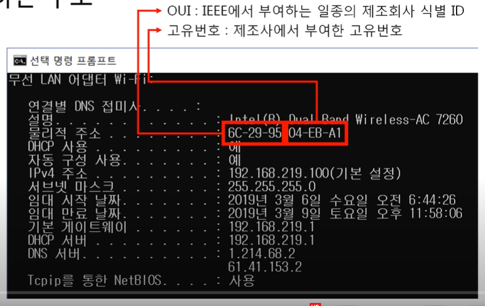

# 03. 근거리 네트워크

### 💡 2 계층에서 하는 일

#### 📌 2 계층의 기능

- **하나의 네트워크 대역**, 즉 **같은 네트워크 상**에 존재하는 **여러 장비들 간의 데이터를 전달**

- **오류 제어** + **흐름 제어** 수행

#### 📌 2 계층 네트워크 크기

- **하나의 네트워크 대역 LAN** 에서만 통신할 때 사용된다.
- **다른 네트워크**과 통신할 때는 항상 **3계층**이 도와주어야 한다.

#### 📌 2 계층에서 사용하는 주소

- **MAC 주소** (물리적인 주소)
  - LAN에서 통신할 때 사용

### 💡 2 계층의 프로토콜

#### 📌 Ethernet 프로토콜

- LAN 에서 통신할 때 사용.png)

- `Destinatino Address` : 목적지 MAC 주소
- `Source Address` : 출발지 MAC 주소
- `Ethernet Type` : (프토토콜 타입) 페이로드 안에 있는 3 계층 프로토콜이 무엇인지 알려줌
  - `IPv4` (0800) or `ARP` (0806)

.png)