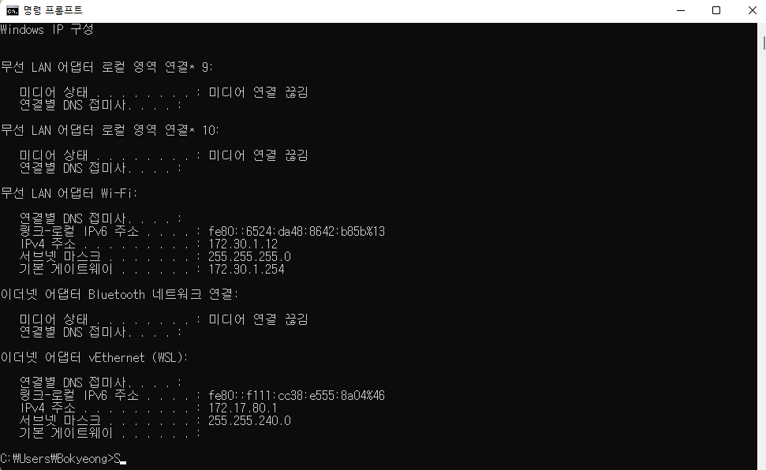

# 04. 실제로 컴퓨터끼리는 IP 주소를 사용해 데이터를 주고받는다

### 💡 3계층의 기능

#### 📌 3계층에서 하는 일

- 서로 **다른 LAN**, **다른 네트워크 대역** 즉, 멀리 떨어진 곳에 존재하는 네트워크까지 어떻게 데이터를 전달할 지 제어하는 일을 담당
- 발신에서 착신까지의 패킷의 경로를 제어

#### 📌 3계층에서 쓰는 주소

- WAN 에서 통신할 때 사용하는 IP 주소
- IP 주소만 가지고는 멀리 있는 네트워크와 통신 할 수 없음

#### 📌 3계층 프로토콜

- `ARP 프로토콜` : IP 주소를 이용해 MAC 주소를 알아냄
- `IPv4 프로토콜` : WAN 에서 통신할 때 사용
  - `IPv6 프로토콜` : 주소와 생김새가 IPv4와 전혀 다르다
- `ICMP 프로토콜` : 서로가 통신 되는지 확인할 때 사용

### 💡 일반적인 IP 주소

#### 📌 Classful IP 주소

- 필드를 기준으로 나눔 (.)

- A 클래스 : 네트워크 대역의 수가 적고 하나의 네트워크 내에 존재하는 PC가 많음

- B 클래스 : 네트워크 대역의 수를 늘리고 네트워크 내에 존재하는 PC 개수를 줄임

  

- **단점**
  - 낭비가 심함
    - A 클래스의 경우 네트워크 대역에 PC 개수가 적을 때 낭비가 크다

#### 📌 Classless IP 주소

- 필드(.) 을 기준으로 나누지 않고 bit  기준으로 잘라서 쓴다.
  - 낭비가 적다.
- 서브넷 마스크
  - 네트워크 대역을 어디서 부터 구분할건지 지정하는 값
  - 2진수로 표기했을 때 1로 시작, 1과 1 사이에는 0이 올 수 없다는 규칙을 가지고 있다.

- `서브넷팅` : 하나의 네트워크를 잘게 쪼개는 것
- `슈퍼넷팅` : 쪼개진 네트워크 대역을 하나로 합치는 것

#### 📌 사설 IP와 공인 IP

- 현재 사용하고 있는 IPv4
- 공인 IP 1개 당 2³²개의 사설 IP
  - 사설 IP대역 내에서는 사설 IP를 사용해서 서로 통신을 하고 사설 IP를 사용하고 있는 장비들이 외부와 네트워크 통신을 할 때, 공인 IP로 바꾸어서 인터넷과 통신
    - 외부에서는 사설 IP 를 구분할 수 없다.
  - `NAT(Network Address Translation)` : 공유기에서 네트워크 주소를 사설 IP 에서 공인 IP (or 공인 → 공인)로 바꾸어 주는 것
- 공유기가 내부적인 처리를 하기 때문에 외부에서 볼 때는 사설 네트워크 대역이 없는 것 처럼 보인다.
  - 나갈 때 NAT 테이블에 요청 기록 후 응답 시, 해당 테이블을 참조하여 해당 기기로 전달
  - 만약 나간 적이 없으면 공유기에서 받고 끝
    - 따라서 서버는 사설 IP 를 사용하지 않는다.

#### 📌 특수한 IP 주소

- `Wildcard 0.0.0.0/0`
  - 나머지 모든 IP
  - 일반적 x

- `127.0.0.1` 
  - 나 자신을 나타내는 주소

- 게이트웨이 주소
  - 외부 세상으로 나가는 문 → 어딘가로 가려면 일단 여기로
  - 일반적으로 공유기 IP
    - 일반적으로 해당 네트워크에서 쓸 수 있는 IP중 가장 작거나 큰걸 쓴다.

### 💡 실습

- cmd에 있는 것은 내부(사설) IP
- 네이버에서 찾는 IP 주소는 공인 IP