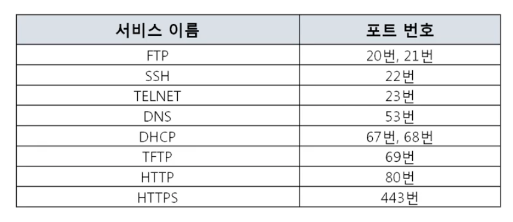
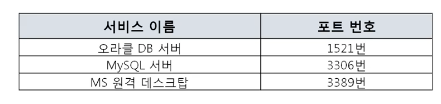
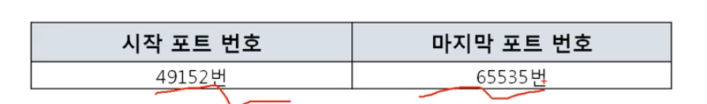

# 07. 클라이언트 서버

### 4계층 프로토콜

**4계층에서 하는 일**

- 전송 계층은 송신자의 **프로세스**와 수신자의 **프로세스를 연결하는 통신 서비스**를 제공
- 전송 계층은 `연결 지향 데이터 스트림 지원`, `신뢰성`, `흐름 제어`, `다중화` 등의 서비스 제공
- `TCP`, `UDP`

**4계층 프로토콜의 종류**

- UDP
  - 보내고 끝
- TCP
  - 안전한 연결을 지향

### 포트번호

**포트번호의 특징**

- 특정 프로세스와 특정 프로세스가 통신을 하기 위해 사용

- 하나의 포트는 

  하나의 프로세스만 사용 가능

  - 내 포트 하나가 상대방의 포트 여러개와 연결 가능

- 하나의 프로세스가 **여러개의 포트 사용 가능**

**Well-Known 포트**

**Register 포트**

**Dynamic 포트**

- Client는 위번호 중 랜덤 포트를 이용하여 외부 프로세스 이용

**포트 주소 + IP 주소 + MAC주소**