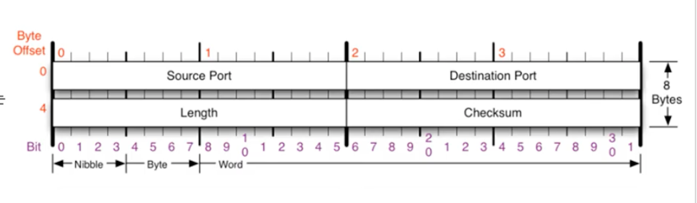

# 08. 비연결지향형 UDP 프로토콜

### UDP 프로토콜

**UDP가 하는 일**

- 사용자 데이터 프로토콜(User Datagram Protocol, UDP)

- 단순한 전송 방식

- 일반적으로 오류의 검사와 수정이 필요없는 프로그램에서 수행

  - 단점
    - 신뢰성 낮음
    - 도착 순서가 바뀌거나, 중복, 누락 가능

  

**UDP 프로토콜을 사용하는 대표적인 프로그램들**

- `DNS 서버`
  - 도메인을 물으면 IP를 알려줌
- `tftp 서버`
  - UDP로 파일을 공유
  - 큰 파일의 경우에는 TCP 사용
  - 파일 전송을 UDP로 하는 이유?
    - 동영상 스트리밍의 경우 몇 패킷이 사라져도 잘 모르기 때문에 사용할 수 있다.
- `RIP 프로토콜`
  - 라우팅 정보 공유