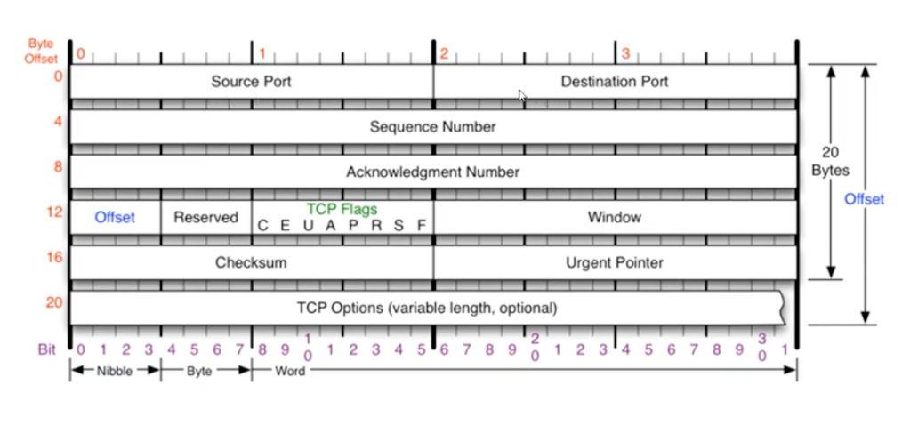
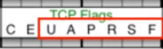
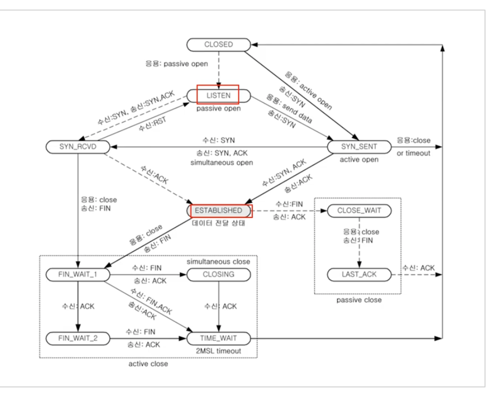

# 09. 연결지향형 TCP 프로토콜

### TCP 프로토콜

**TCP가 하는 일**

- 전송 제어 프로토콜(Transmission Control Protocol, TCP)

- **안정적으로, 순서대로, 에러없이** 교환할 수 있게 한다.

- **단점**

  - UDP보다 느리다. (하지만 요즘은 거의 차이 없음)

  

- 20 ~ 60 byte까지 가능하다.

- Offset: Header의 길이 ( / 4해서 표시)

- Reserved : 예약된 필드로 사용하지 않음

- Checksum : 데이터 보내도 되는지 확인 후 얼마만큼 더 보내도 될 지 알려주는 역할 (TCP Buffer의 가용 용량)

### TCP 플래그

- TCP의 주된 기능을 결정하는 부분
- U(Urgent) : 긴급 비트
  - 우선 순위가 높은 부분이 포함되어 있음을 알림
  - Urgent Pointer가 해당 데이터의 마지막 위치를 알려줌
- A(ACKnowledgement) : 승인 비트
  - TCP의 확인 응답 번호(ACK num)가 유효함을 뜻함(4byte)
  - 물어본 것에 대한 승인을 해줄때 사용
  - 연결 시작 후 항상 1
- P(Push) :
  - TCP 버퍼와 상관없이 밀어 넣을 때 사용
- R(ReSeT) : 강제 연결 초기화 비트
  - 연결 된 회선에 강제 리셋 요청
- S(SYNchronize) : 연결 시작
  - TCP 연결 설정
  - SYN = 1, ACK = 0 ⇒ 연결 요청
  - SYN = 1, ACK = 1 ⇒ 연결 승인
  - ACK = 1 ⇒ 연결 설정
- F(FINinsh) : 연결 해제
  - 송신기가 데이터 보내기를 끝마침
  - FIN = 1 ⇒ 연결 해제 요청
  - FIN = 1, ACK = 1 ⇒ 연결 해제 승인

### TCP를 이용한 통신과정

- TCP를 이용한 데이터 통신을 할 때 프로세스와 프로세스를 연결하기 위해 **가장 먼저 수행되는 과정**

**3Way Handshake(연결 수립 과정)**

1. 클라이언트가 서버에 요청 패킷 전송 (SYN = 1, ACK = 0, S= 100 (랜덤))
   - SYN 세그먼트
2. 서버가 클라이언트의 요청을 받아들이는 패킷 전송 (SYN = 1, ACK = 1, S = 2000, A = 101)
   - SYN + ACK 세그먼트
3. 클라이언트는 이를 최종적으로 수락하는 패킷 전송 (SYN = 0, ACK = 1, S = 101, A = 2001)
   - ACK 세그먼트

ACK 번호는 받는 SEQ번호 + 1

SEQ 번호는 받은 ACK 번호

⇒ 동기화 되었다.

**데이터 송수신 과정**

1. 보낸쪽에서 또 요청을 보낼 때, SEQ번호와 ACK번호가 그대로다.
2. 받는 쪽에서 SEQ번호는 받은 ACK번호가 된다.
3. 받는 쪽에서 ACK번호는 SEQ번호 + 받은  데이터의 크기

### TCP의 상태전이도

- LISTEN : 해당 포트번호를 사용하고 있는 상태 (PASSIVE OPEN)
  - 요청이 오면 반응할 수 있게 듣고 있는 서버의 상태
- ESTABLISHED : 서버와 클라이언트가 연결된 상태

