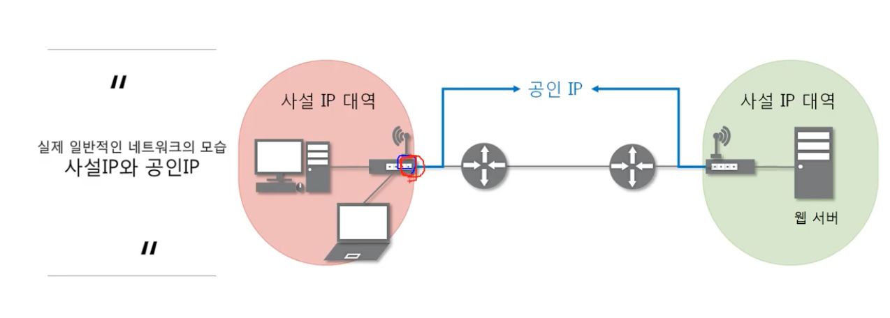
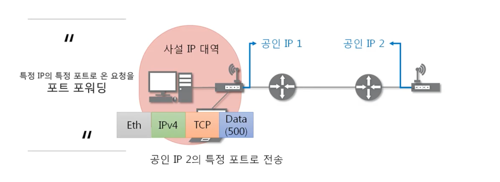

# 10_NAT, 포트포워딩

### NAT(Network Address Translation)

- IP패킷의 TCP/UDP 포트 숫자와 소스 및 목적지의 IP 주소 등을 재기록하면서 라우터를 통해 네트워크 트래픽을 주고 받는 기술

- 패킷에 변화가 생기기 때문에 IP나 TCP/UDP의 체크섬도 다시 계산 해서 재기록

- 사설 네트워크에 속한 여러개의 호스트가 하나의 공인 IP 주소를 사용하여 인터넷에 접속하기 위함

  - ⇒ 다른 포트 번호로 바꿔주는 것

    

- 공유기 안에 NAT 테이블이 있어서 요청을 기록

  - 응답이 왔을 때 해당 디바이스를 찾아서 응답을 반환해줌

### 포트 포워딩

- **(NAT)의 응용**

- 주로 공유기나 기타 네트워크 기기에서 실행

- 게이트웨이의 반대쪽에 위치한 사설 네트워크에 존재하는 호스트에 대한 서비스를 생성하기 위해 사용

  

  - 현재 IP는 공인 IP이다.
  - 공유기가 특정 포트로 들어온 요청을 다른 특정 IP의 특정 포트로 전송