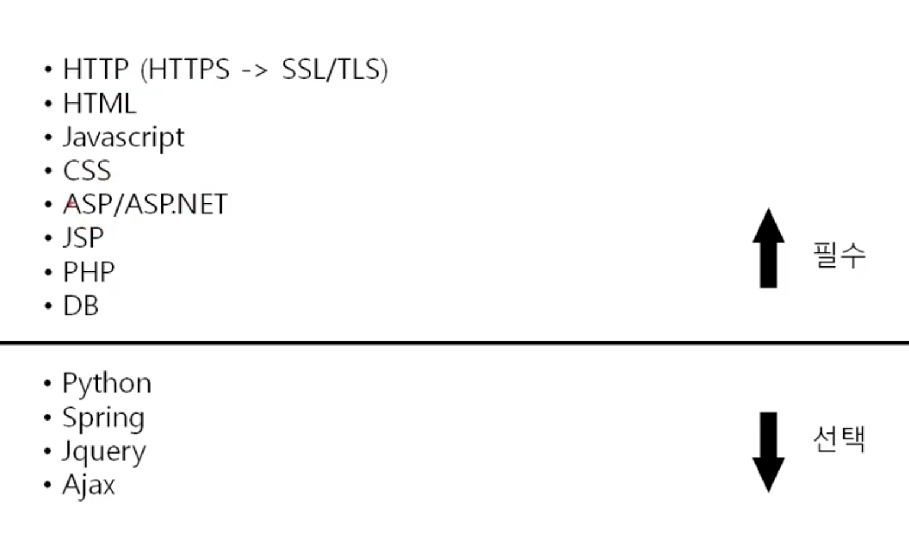
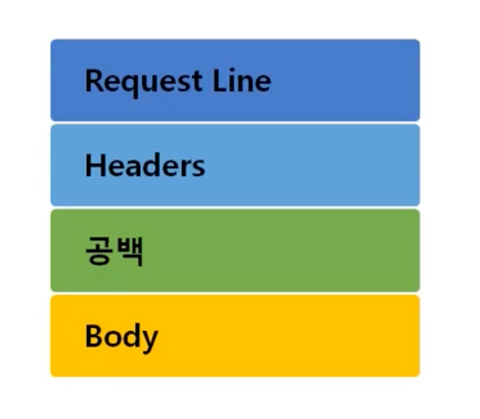
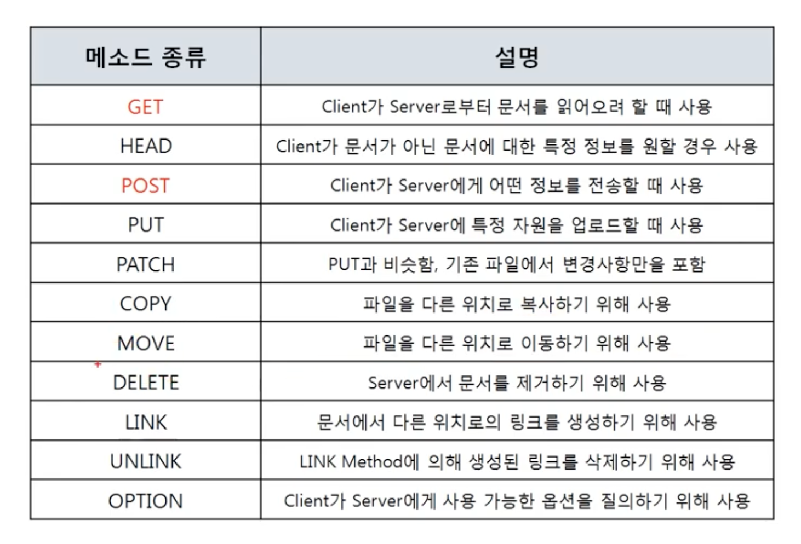
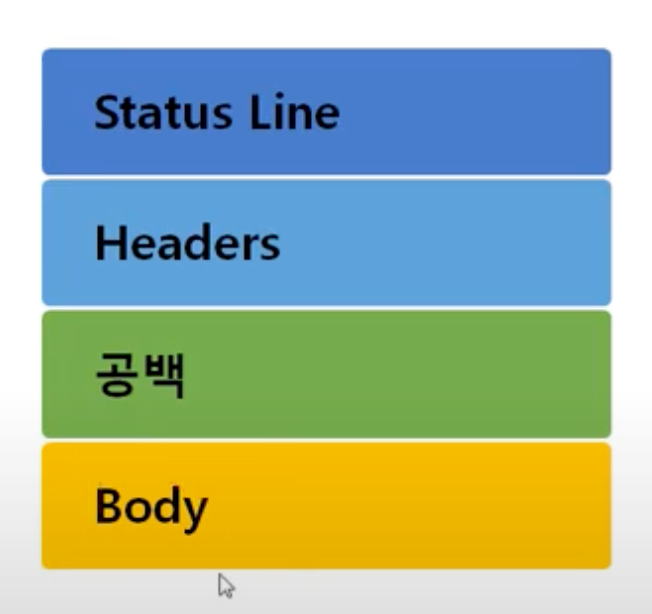
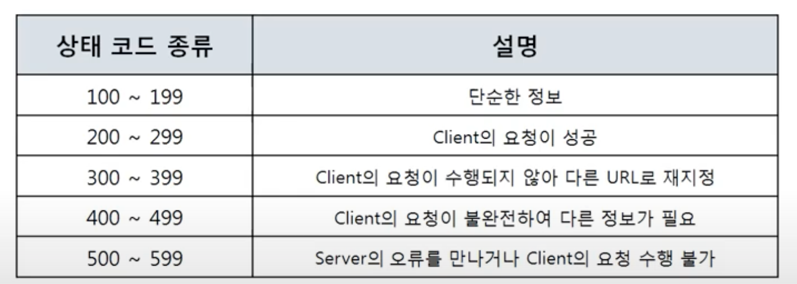
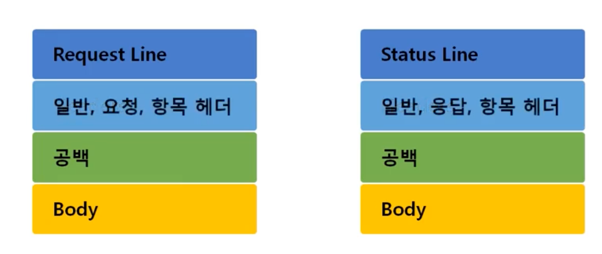

# 11_HTTP 프로토콜


**웹을 만들기 위해 사용되는 다양한 기술들**



- HTTP : HTML, JS, CSS와 같은 파일을 웹 서버에 요청하고 받아오는 프로토콜

### HTTP 프로토콜 (HyperText Transfer Protocol)

- 특징
  - www에서 쓰이는 핵심 프로토콜
  - 문서의 전송, 이미지, 음성 등 여러 종류의 데이터를 MIME로 정의하여 전송 가능
  - Request / Response 동작에 기반하여 서비스 제공

**HTTP 요청 프로토콜**

- 요청하는 방식을 정의하고 클라이언트의 정보를 담고 있다.

  

- 리퀘스트

  

  **요청 타입**

  - GET, POST, PUT, PATCH, DELETE

    

    GET : 주소창에 같이 보냄

    POST: Body에 파라미터를 담아서 보냄

    - 하지만 이것도 보일 수 있으니 https를 사용하여야 한다.

  **URI (Uniform Resource Identifier)**

  - scheme://host[:port][/path][?query]
  - 도메인 주소를 IP주소로 바꿈(DNS)

- 헤더

- 바디

**HTTP 응답 프로토콜**

- 사용자가 볼 웹 페이지를 담고 있음

  

- Status Line

  

  - 상태 코드

    

**HTTP 헤더**



- 일반 헤더

  - 일반적인 정보를 담고 있다.
  - Content-Length, Content-Type(ex. text/html)

- 요청 헤더

  - 클라이언트의 정보를 담고 있다.

  - `Cookie`: 서버로부터 받은 쿠키를 다시 서버에게 보내주는 역할

  - `Host` : 요청된 URL에 나타난 호스트명을 상세하게 표시(HTTP 1.1은 필수)

  - ```
    User-Agent
    ```

    : Client Program에 대한 식별가능 정보를 제공

    - 디바이스, 브라우저 등의 정보를 제공