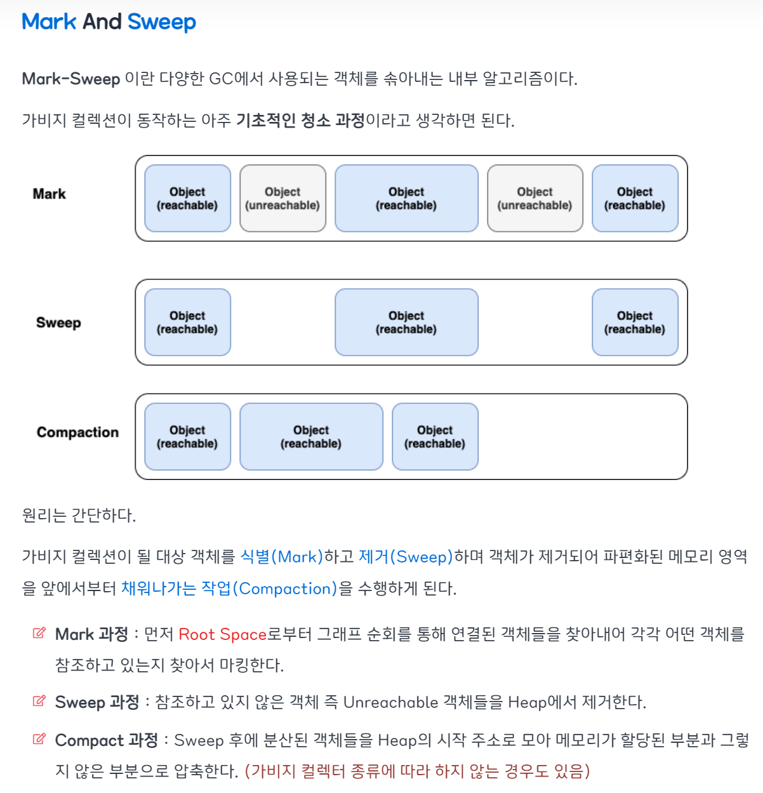

#### 1. 동기와 비동기의 차이는 무엇인가요 ?

동기란 말 그대로 동시에 일어난다는 뜻이며, 비동기란 동시에 일어나지 않는다를 의미합니다. 

**동기방식**은 설계가 매우 간단하고 직관적이지만 결과가 주어질 때까지 아무것도 못하고 대기해야 하는 단점이 있고, 

 **비동기방식**은 동기보다 복잡하지만 결과가 주어지는데 시간이 걸리더라도 그 시간 동안 다른 작업을 할 수 있으므로 자원을 효율적으로 사용할 수 있는 장점이 있습니다.

#### 2. 세마포어와 뮤텍스의 차이에 대해 설명해보세요.

프로세스 간 메시지를 전송하거나, 공유메모리를 통해 공유된 자원에 여러 개의 프로세스가 동시에 접근하면 **Critical Section** 문제가 발생할 수 있다.

이를 해결하기 위해 데이터를 한 번에 하나의 프로세스만 접근할 수 있도록 제한을 두는 **동기화 방식**을 취해야 한다.

동기화 도구에는 대표적으로 **뮤텍스(Mutex)**와 **세마포어(Semaphore)**가 있다.

이들은 모두 공유된 자원의 데이터를 여러 스레드/프로세스가 접근하는 것을 막는 역할을 한다.

 **뮤텍스(Mutex)**

**동시 프로그래밍에서 공유 불가능한 자원의 동시 사용을 피하기 위해 사용하는 알고리즘**

- 임계구역(Critical Section)을 가진 스레드들의 실행시간(Running Time)이 서로 겹치지 않고 각각 단독으로 실행(**상호배제_Mutual Exclution**)되도록 하는 기술

- 한 프로세스에 의해 소유될 수 있는 Key를 기반으로 한 상호배제 기법

  - Key에 해당하는 어떤 객체(Object)가 있으며, 이 객체를 소유한 스레드/프로세스만이 공유자원에 접근할 수 있다.

- 다중 프로세스들의 공유 리소스에 대한 접근을 조율하기 위해 동기화(Synchronization) 또는 락(Lock)을 사용.

- 즉, 뮤텍스 객체를 두 스레드가 동시에 사용할 수 없다.

  

## **세마포어(Semaphore)**

**멀티 프로그래밍 환경에서 공유된 자원에 대한 접근을 제한하는 방법** 

- 공유자원의 상태를 나타낼 수 있는 **카운터**로 생각할 때,
  - 사용하고 있는 스레드/프로세스의 수를 공통으로 관리하는 하나의 값을 이용해 상호배제를 달성한다.
  - 운영체제 또는 커널의 한 지정된 저장장치 내의 값
  - 일반적으로 비교적 긴 시간을 확보하는 리소스에 대한 이용
  - 유닉스 프로그래밍에서 세마포어는 운영체제의 리소스를 경쟁적으로 사용하는 다중 프로세스에서 행동을 조정하거나 또는 동기화하는 기술
- 공유 자원에 접근할 수 있는 프로세스의 최대 허용치만큼 동시에 사용자가 접근할 수 있다.
- 각 프로세스는 세마포어의 값을 확인하고 변경할 수 있다.
- 자원을 사용하지 않는 상태가 될 때, 대기하던 프로세스가 즉시 자원을 사용한다.
- 이미 다른 프로세스에 의해 사용중이라는 사실을 알게 되면, 재시도 전에 일정시간 대기해야 한다.
- 세마포어를 사용하는 프로세스는 그 값을 확인하고, 자원을 사용하는 동안에는 그 값을 변경함으로써 다른 세마포어 사용자들이 대기하도록 해야 한다.
- 세마포어는 이진수를 사용하거나 추가적인 값을 가질 수 있다.

## **뮤텍스와 세마포어의 차이점**

1. 가장 큰 차이점은 **동기화 대상의 갯수**이다.
   1. Mutex는 동기화 대상이 only 1개일 때 사용
   2. Semaphore는 동기화 대상이 1개 이상일 때 사용
2. 세마포어는 뮤텍스가 될 수 있지만, 뮤텍스는 세마포어가 될 수 없다.
   1. Mutex는 0, 1로 이루어진 이진 상태를 가지므로 Binary Semaphore!
3. Mutex는 자원 소유 가능 + 책임을 가지는 반면, Semaphore는 자원 소유 불가
   1. 뮤텍스는 상태 0, 1 뿐이므로 Lock 가질 수 있음
4. Mutex는 소유하고 있는 스레드만이 이 Mutex를 해제할 수 있다.
   1. 반면, Semaphore는 Semaphore를 소유하지 않는 스레드가 Semaphore를 해제할 수 있다.
5. Semaphore는 시스템 범위에 걸쳐 있고, 파일 시스템 상의 파일로 존재한다.
   1. 반면, Mutex는 프로세스의 범위를 가지며 프로세스 종료될 때 자동으로 Clean up 된다.

 

뮤텍스와 세마포어는 모두 완벽한 기법은 아니므로, 데이터 무결성을 보장할 수 없으며 모든 교착 상태를 해결하지는 못한다.

하지만, 상호배제를 위한 기본적인 기법이며 여기에 좀 더 복잡한 매커니즘을 적용해 개선된 성능을 가질 수 있도록 하는 것이 중요하다.

#### 3. 함수 콜이랑 시스템 콜이 어떻게 다른지 설명해보세요.

시스템 호출은 시스템에 내장 된 서브 루틴에 대한 호출이고 함수 호출은 프로그램 내의 서브 루틴에 대한 호출입니다.

함수 호출과 달리 시스템 호출은 프로그램이 권한이없는 일부 작업을 수행해야 할 때 사용됩니다.

시스템 호출은 운영 체제 커널의 진입 점이며 프로그램에 연결되지 않습니다 (예 : 함수 호출).

시스템 호출과 달리 함수 호출은 이식 가능합니다.

사용자 모드와 커널 모드간에 전환이 발생해야하므로 시스템 호출의 시간 오버 헤드는 함수 호출의 오버 헤드보다 큽니다.

시스템 호출은 커널 주소 공간에서 실행되는 반면 함수 호출은 사용자 주소 공간에서 실행됩니다.

#### 4. Garbage Collection 이란 무엇일까요 ? Garbage Collection 방식 중 제일 잘 알고 계시는 GC를 아무거나 하나만 설명해주세요.

가비지 컬렉션은 자바의 메모리 관리 방법 중의 하나로 JVM의 Heap 영역에서 **동적으로 할당했던 메모리 영역 중 필요 없게 된 메모리 영역을 주기적으로 삭제하는 프로세스**를 말합니다.

**포인터 추적 방식** 

포인터 추적 방식은 한 개 이상의 변수가 접근 가능한 메모리는 사용하고있는 메모리라 간주하고, 그 밖의 메모리를 해제하는 방식이다. 

이때 접근 가능한 메모리의 의미는 어떤 변수가 가리키는 직/간접적인 메모리를 의미하고 재귀적으로 접근하여 모든 접근 가능한 메모리를 파악 할 수 있다. 
변수가 가리키는 객체 즉, 지역 변수와 전역 변수 모두를 포함한다. 
접근 가능한 객체가 가리키는 모든 객체는 마찬가지로 접근 가능하다. 

#### Mark and Sweep

- Mark: 사용되는 메모리와 사용되지 않는 메모리를 식별하는 작업
- Sweep: Mark 단계에서 사용되지 않음으로 식별된 메모리를 해제하는 작업

Stop The World를 통해 모든 작업을 중단시키면, GC는 스택의 모든 변수 또는 Reachable 객체를 스캔하면서 각각이 어떤 객체를 참고하고 있는지를 탐색하게 된다. 그리고 사용되고 있는 메모리를 식별하는데, 이러한 과정을 Mark라고 한다. 이후에 Mark가 되지 않은 객체들을 메모리에서 제거하는데, 이러한 과정을 Sweep라고 한다.

#### 5. Deadlock 의 조건

#### 6. 컴퓨터는 소숫점 계산을 잘 못합니다. 그 이유가 무엇일까요 ? 어떻게 문제를 해결할 수 있을까요 ? 직접 구현한다면 어떻게 하시겠습니까 ?

숫자를 다룰 때 우리는 10진법을 사용하지만 컴퓨터는 2진법을 사용하기 때문이다. 

파이썬의 decimal, math.isclose, round() 등의 메서드를 사용한다.