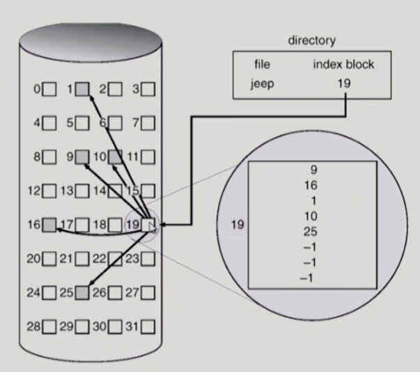
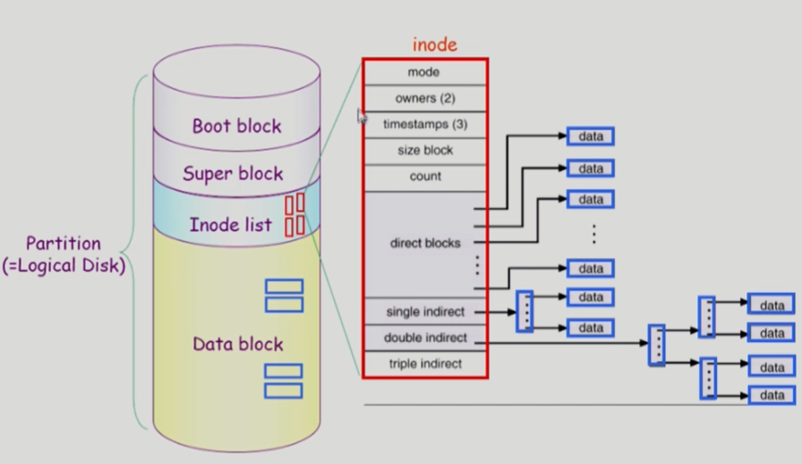
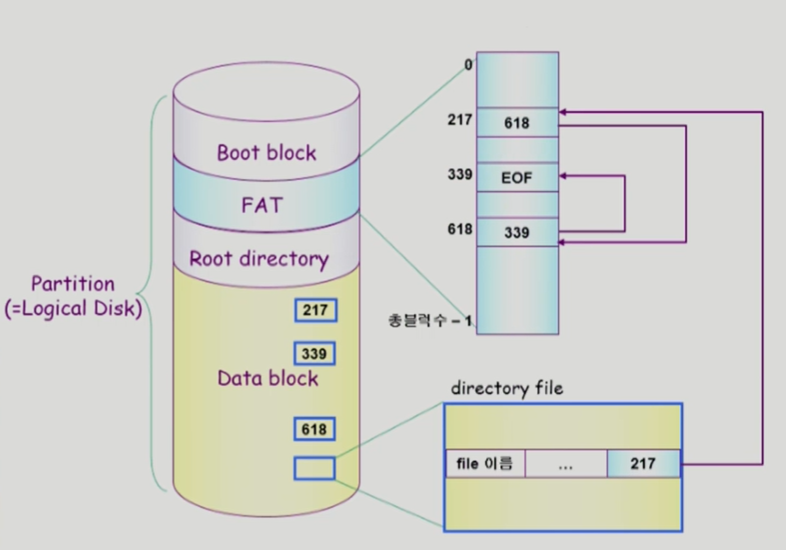
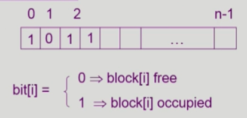
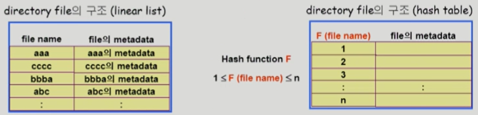
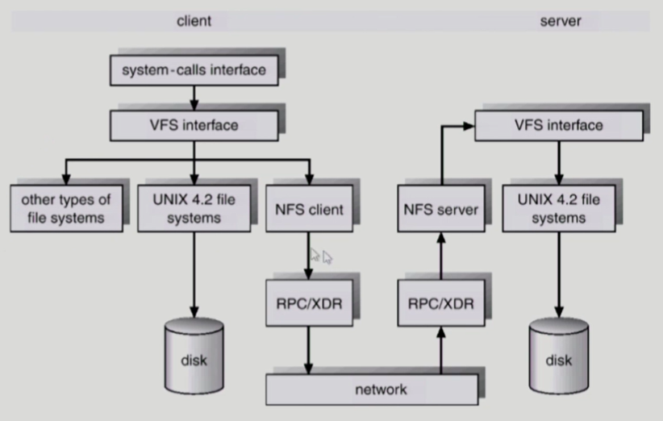
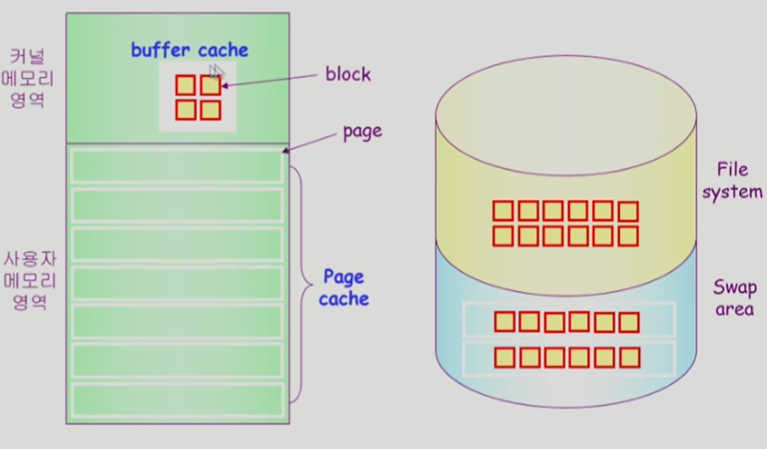
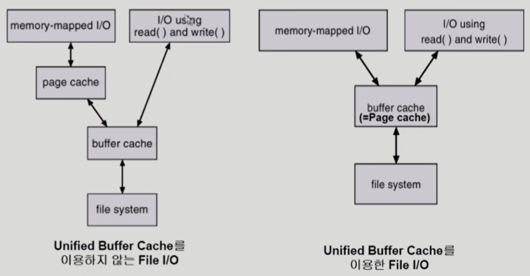
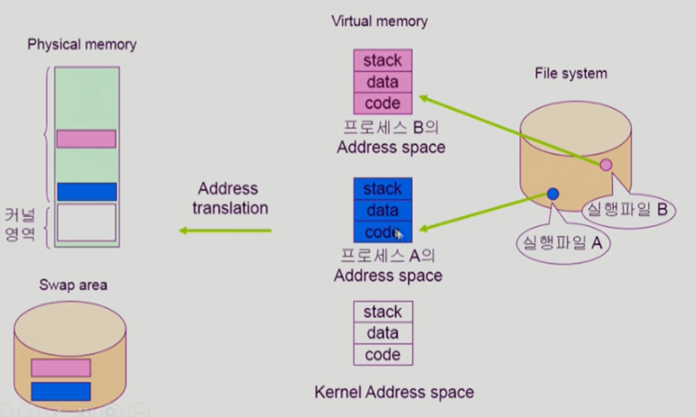
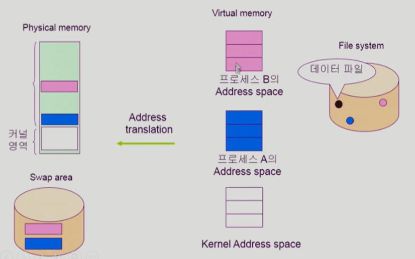

# 💫 File System, File System Implementation

## ✨ File and File System

- **File**
  - "A named collection of related information"
  - 일반적으로 비휘발성의 보조기억장치에 저장 (ex. 하드디스크)
  - 운영체제는 다양한 저장 장치를 file이라는 동일한 논리적 단위로 볼 수 있게 해 줌
  - Operation (연산)
    - create, read, write, reposition (lseek), delete, open, close 등
- **File attribute (혹은 파일의 metadata)**
  - 파일 자체의 내용이 아니라 파일을 관리하기 위한 각종 정보들
    - 파일 이름, 유형, 저장된 위치, 파일 사이즈
    - 접근 권한 (읽기/쓰기/실행), 시간 (생성/변겅/사용), 소유자 등
- **File system**
  - 운영체제에서 파일을 관리하는 부분
  - 파일 및 파일의 메타데이터, 디렉토리 정보 등을 관리
  - 파일의 저장 방법 결정
  - 파일 보호 등

## ✨ Directory and Logical Disk

- **Directory**
  - 파일의 메타데이터 중 일부를 보관하고 있는 일종의 특별한 파일
  - 그 디렉토리에 속한 파일 이름 및 파일 attribute 들
  - operation
    - search for a file, create a file, delete a file
    - list a directory, rename a file, traverse the file system
- **Partition (=Logical Disk)**
  - 하나의 (물리적) 디스크 안에 여러 파티션을 두는게 일반적
  - 여러 개의 물리적인 디스크를 하나의 파티션으로 구성하기도 함
  - (물리적) 디스크를 파티션으로 구성한 뒤 각각의 파티션에 file system 을 깔거나 swapping 등 다른 용도로 사용할 수 있음

## ✨ `open()`

- open("/a/b/c")
  - 디스크로부터 파일 c의 메타데이터를 메모리로 가지고 옴
  - 이를 위하여 directory path 를 search
    - 루트 디렉토리 "/"를 open 하고 그 안에서 파일 "a" 의 위치 획득
    - 파일 "a"를 open 한 후 read 하여 그 안에서 파일 "b"의 위치 획득
    - 파일 "b"를 open 한 후 read 하여 그 안에서 파일 "c"의 위치 획득
    - 파일 "c"를 open한다
  - Directory path의 search에 너무 많은 시간 소요
    - Open을 read / write 와 별도로 두는 이유임
    - 한번 open 한 파일은 read / write  시 directory search 불필요
  - Open file table
    - 현재 open 된 파일들의 메타데이터 보관소 (in memory)
    - 디스크의 메타데이터보다 몇 가지 정보가 추가
      - Open 한 프로세스의 수
      - File Offset : 파일 어느 위치 접근 중인지 표시 (별도 테이블 필요)
    - File descriptor (file handle, file control block)
      - Open file table 에 대한 위치 정보 (프로세스 별)

## ✨ File Protection

- 각 파일에 대해 누구에게 어떤 유형의 접근 (read/write/execution)을 허락할 것인가 ?
- **Access Control 방법**

#### 💡 Access control Matrix

		- Access control list : 파일별로 누구에게 어떤 접근 권한이 있는지 표시
		- Capability list : 사용자별로 자신이 접근 권한을 가진 파일 및 해당 권한 표시

#### 💡 Grouping

- 전체 user를 owner, group, public의 세 그룹으로 구분
- 각 파일에 대해 세 그룹의 접근 권한 (rwx) 을 3비트씩으로 표시
- 예 ) UNIX

#### 💡Password

- 파일마다 password를 두는 방법 ( 디렉토리 파일에 두는 방법도 가능 )
- 모든 접근 권한에 대해 하나의 password : all-or-nothing
- 접근 권한별 password: 암기 문제, 관리 문제

## ✨ File System의 Mounting

## ✨ Access Methods

- 시스템이 제공하는 파일 정보의 접근 방식
  - 순차 접근 (sequential access)
    - 카세트 테이프를 사용하는 방식처럼 접근
    - 읽거나 쓰면 offset 은 자동적으로 증가
  - 직접 접근 (direct access, random access)
    - LP 레코드 판과 같이 접근하도록 함
    - 파일을 구성하는 레코드를 임의의 순서로 접근할 수 있음

## ✨ Allocation of File Data in Disk

- Contiguous Allocation (연속 할당)
- Linked Allocation (연결 할당)
- Indexed Allocation 

### 📢 Contiguous Allocation (연속 할당)

- 메모리 관리 페이징 기법과 유사

- 장점
  - Fast I/O
    - 한번의 seek / rotation 으로 많은 바이트 transfer
    - Realtime file 용으로, 또는 이미 run 중이던 process의 swapping 용
  - Direct access(=random access) 가능
- 단점
  - external fragmentation
  - File grow 가 어려움 (파일 크기를 키우기 어려움)
    - file 생성시 얼마나 큰 hole을 배당할 것인가 ?
    - grow 가능 vs 낭비 (internal fragmentation)

### 📢 Linked Allocation

- 장점
  - External fragmentation 발생 안 함
- 단점
  - No random access
  - Reliability 문제
    - 한 sector가 고장나 pointer가 유실되면 많은 부분을 잃음
  - Pointer를 위한 공간이 block의 일부가 되어 공간 효율성을 떨어뜨림
    - 512 bytes/sector, 4 bytes/pointer
- 변형
  - File-allocation table (FAT) 파일 시스템
    - 포인터를 별도의 위치에 보관하여 reliability와 공간효율성 문제 해결

### 📢 Indexed Allocation

- 장점
  - External fragmentation 이 발생하지 않음
  - Direct access 가능
- 단점
  - Small file의 경우 공간 낭비 (실제로 많은 file들이 small)
  - Too Large file 의 경우 하나의 block 으로 index 를 저장하기에 부족
    - 해결 방안
      1. linked scheme (또 다른 index를 가리키게 하는 것)
      2. multi-level index

## ✨UNIX 파일시스템의 구조

#### 💡 유닉스 파일 시스템의 중요 개념

- **Boot block** (어떤 파일 시스템이든 모두 boot block이 가장 앞에 있음)
  - 부팅에 필요한 정보 (bootstrap loader)
- **Superblock**
  - 파일 시스템에 관한 총체적인 정보를 담고 있다.
- **Inode list**
  - 파일 이름을 제외한 파일의 모든 메타 데이터를 저장
- **Data block**
  - 파일의 실제 내용을 보관

## ✨ FAT File System

## ✨ Free-Space Management

#### 💡Bit map or bit vector

- Bit map 은 부가적인 공간을 필요로 함
- 연속적인 n 개의 free block 을 찾는데 효과적

#### 💡 Linked list

- 모든 free block 들을 링크로 연결 (free list)
- 연속적인 가용공간을 찾는 것은 쉽지 않다
- 공간의 낭비가 없다

#### 💡 Grouping

- linked list 방법의 변형
- 첫번째 free block이 n개의 pointer를 가짐
  - n-1 pointer 는 free data block 을 가리킴
  - 마지막 pointer가 가리키는 block은 또 다시 n pointer 를 가짐

#### 💡 Counting

- 프로그램들이 종종 여러 개의 연속적인 block을 할당하고 반납한다는 성질에 착안
- (first free block, # of contiguous free blocks) 을 유지

## ✨ Directory Implementation

- Linear list
  - <file name, file의 metadata>의 list
  - 구현이 간단
  - 디렉토리 내에 파일이 있는지 찾기 위해서는 linear search 필요 (time-consuming)
- Hash Table
  - linear list + hashing
  - Hash table은 file name을 이 파일의 linear list의 위치로 바꾸어줌
  - search time을 없앰
  - Collision 발생 가능 

- File의 metadata 의 보관 위치
  - 디렉토리 내에 직접 보관
  - 디렉토리에는 포인터를 두고 다른 곳에 보관
    - inode, FAT 등
- Long file name의 지원
  - <file name, file 의 metadata>의 list에서 각 entry는 일반적으로 고정 크기
  - file name이 고정 크기의 entry 길이보다 길어지는 경우 entry 의 마지막 부분에 이름의 뒷부분이 위치한 곳의 포인터를 두는 방법
  - 이름의 나머지 부분은 동일한 directory file의 일부에 존재

## ✨ VFS and NFS

- Virtual File System (VFS)
  - 서로 다른 다양한 file system 에 대해 동일한 시스템 콜 인터페이스 (API) 를 통해 접근할 수 있게 해주는 OS의 layer
- Network File System (NFS)
  - 분산 시스템에서는 네트워크를 통해 파일이 공유될 수 있음
  - NFS는 분산 환경에서의 대표적인 파일 공유 방법임

## ✨ Page Cache and Buffer Cache

- **Page Cache**

  - 4kb

  - Virtual memory 의 paging system 에서 사용하는 page frame 을 caching의 관점에서 설명하는 용어
  - Memory-Mapped I/O를 쓰는 경우 file의 I/O 에서도 page cache 사용

- **Memory-Mapped I/O**

  - File의 일부를 virtual memory에 mapping 시킴
  - 매핑시킨 영역에 대한 메모리 접근 연산은 파일의 입출력을 수행하게 함
  - 메모리에 이미 올라온 것은 커널을 쓰지 않고 자신이 직접 할 수 있다

- **Buffer Cache**

  - 파일시스템을 통한 I/O 연산은 메모리의 특정 영역인 buffer cache 사용
  - File 사용의 locality 활용
    - 한 번 읽어온 block에 대한 후속 요청 시 buffer cache에서 즉시 전달
  - 모든 프로세스가 공용으로 사용
  - Replacement algorithm 필요 (LRU, LFU 등)

- **Unified Buffer Cache**

  - 최근의 OS에서는 기존의 buffer cache 가 page cache에 통합됨

## ✨ 프로그램의 실행

