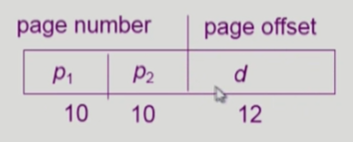
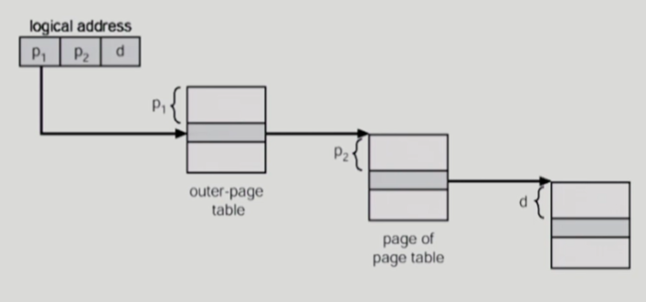
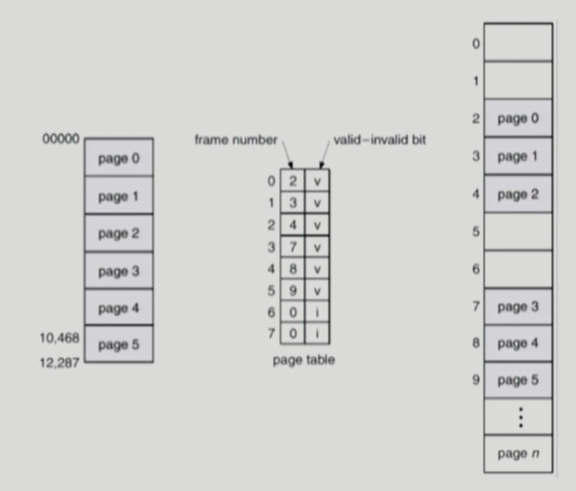
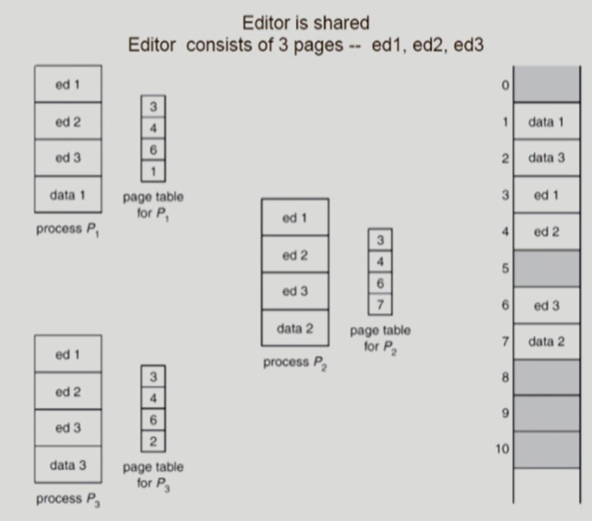
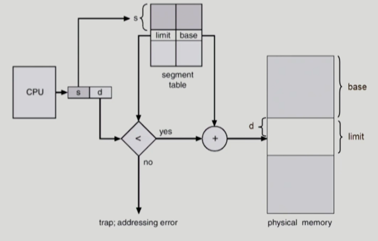
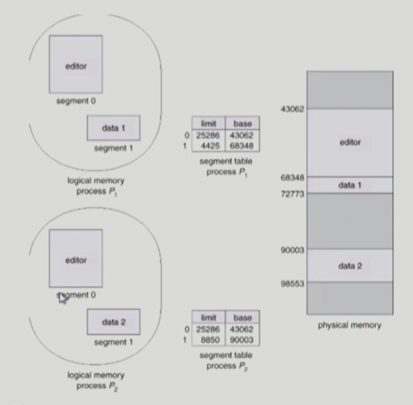
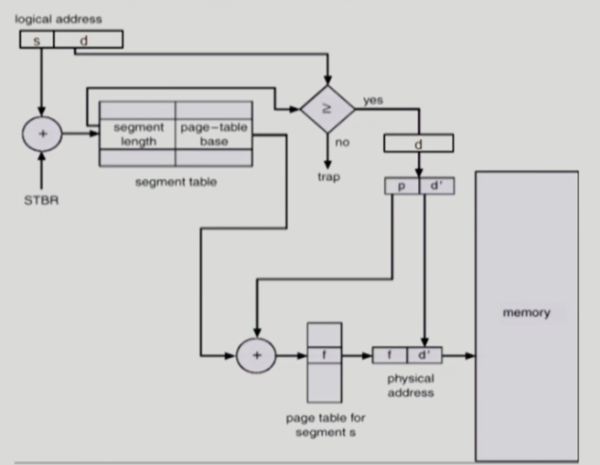

# 💫 Memory Management

## ✨ Logical vs. Physical Address

#### 📌 Logical address (=virtual address)

- 프로세스마다 독립적으로 가지는 주소 공간
- 각 프로세스마다 0번지부터 시작
- CPU가 보는 주소는 logical address임

#### 📌 Physical address

- 메모리에 실제 올라가는 위치


- **주소 바인딩** : 주소를 결정하는 것

​       Symbolic Address → Logical Address → Physical address


## ✨ 주소 바인딩 (Address Binding)

#### 📌 Compile time binding

- 물리적 메모리 주소(physical address)가 컴파일 시 알려짐

- 시작 위치 변경시 재컴파일

- 컴파일러는 절대 코드 (absolute code) 생성

  

#### 📌 Load time binding

- Loader의 책임하에 물리적 메모리 주소 부여

- 컴파일러가 재배치가능코드(relocatable code)를 생성한 경우 가능

  

#### 📌 Execution time binding (= Run time binding)

- 수행이 시작된 이후에도 프로세스의 메모리 상 위치를 옮길 수 있음
- CPU가 주소를 참조할 때마다 binding을 점검 (address mapping table)
- 하드웨어적인 지원이 필요
  (ex. base and limit registers, MMU).


#### 📌 Memeory-Management Unit (MMU)

- **MMU (Memory-Management Unit)**
  - logical address 를 physical address로 매핑해 주는 Hardware device
-  MMU scheme
  - 사용자 프로세스가 CPU에서 수행되며 생성해내는 모든 주소값에 대해 base register (=relocation register)의 값을 더한다
- user program
  - logical addresss 만을 다룬다
  - 실제 physical address를 볼 수 없으며 알 필요가 없다


- Dynamic Relocation


#### 📌Hardware Support for Address Translation


 - 운영체제 및 사용자 프로세스 간의 메모리 보호를 위해 사용하는 레지스터
   - **Relocation register** : 접근할 수 있는 물리적 메모리 주소의 최소값 (=base register)
   - **Limit register** : 논리적 주소의 범위


## ✨Dynamic Loading

- 프로세스 전체를 메모리에 미리 다 올리는 것이 아니라 해당 루틴이 불려질 때 메모리에 load 하는 것
- memory utilization의 향상
- 가끔식 사용되는 많은 양의 코드의 경우 유용
  예 ) 오류 처리 루틴
- 운영체제의 특별한 지원 없이 프로그램 자체에서 구현 가능 (OS는 라이브러리를 통해 지원 가능)
  → **Overlay 와의 차이점**
- Loading : 메모리로 올리는 것


## ✨ Overlay

- 메모리에 프로세스의 부분 중 실제 필요한 정보만을 올림
- 프로세스의 크기가 메모리보다 클 때 유용
- 운영체제의 지원없이 사용자에 의해 구현 → **Dynamic Loading과의 차이점**
- 작은 공간의 메모리를 사용하던 초창기 시스템에서 수작업으로 프로그래머가 구현
  - "Manual Overlay"
  - 프로그래밍이 매우 복잡


## ✨ Swapping

- **Swapping**

  - 프로세스를 일시적으로 메모리에서 backing store로 쫓아내는 것

- **Backing store (=swap area)**

  - 하드디스크에서 쫓겨나서 가는 공간

  - 디스크
    - 많은 사용자의 프로세스 이미지를 담을 만큼 충분히 빠르고 큰 저장 공간

- **Swap in / Swap out**

  - 일반적으로 중기 스케줄러 (swapper)에 의해 **swap out** 시킬 프로세스 선정
  - pirority-based CPU scheduling algorith
    - priority 가 낮은 프로세스를 swapped out 시킴
    - priority가 높은 프로세스를 메모리에 올려 놓음
  - Compile time 혹은 load time binding 에서는 원래 메모리 위치로 **swap in** 해야 함
  - Execution time binding에서는 추후 빈 메모리 영역 아무 곳에나 올릴 수 있음
  - swap time은 대부분 transfer time (swap되는 양에 비례하는 시간)임


## ✨ Dynamic Linking

- Linking을 실행 시간 (execution time) 까지 미루는 기법
- **Static linking**
  - 라이브러리가 프로그램의 실행 파일 코드에 포함됨
  - 실행 파일의 크기가 커짐
  - 동일한 라이브러리를 각각의 프로세스가 메모리에 올리므로 메모리 낭비
    (ex. printf 함수의 라이브러리 코드)
- **Dynamic linking**
  - 라이브러리가 실행시 연결(link) 됨
  - 라이브러리 호출 부분에 라이브러리 루틴의 위치를 찾기 위한 stub이라는 작은 코드를 둠
  - 라이브러리가 이미 메모리에 있으면 그 루틴의 주소로 가고 없으면 디스크에서 읽어옴
  - 운영체제의 도움이 필요


## ✨ Allocation of Physical Memory

- 메모리는 일반적으로 두 영역으로 나뉘어 사용

  - **OS 상주 영역**
    - interrupt vector와 함께 낮은 주소 영역 사용
  - **사용자 프로세스 영역**
    - 높은 주소 영역 사용

- 사용자 프로세스 영역의 할당 방법

  - **Contiguous allocation**
    : 각각의 프로세스가 메모리의 연속적인 공간에 적재되도록 하는 것

    - Fixed partition allocation
    - Variable partition allocation

  - **Noncontiguous allocation**
    : 하나의 프로세스가 메모리의 여러 영역에 분산되어 올라갈 수 있음

    - Paging
    - Segmentation
    - Paged Segmentation

    

### 📌 Contiguous Allocation

#### - 고정분할(Fixed partition) 방식

- 물리적 메모리를 몇 개의 영구적 분할(partition)로 나눔
- 분할의 크기가 모두 동일한 방식과 서로 다른 방식이 존재
- 분할당 하나의 프로그램 적재
- 융통성이 없음
  - 동시에 메모리에 load 되는 프로그램의 수가 고정됨
  - 최대 수행 가능 프로그램 적재
- Internal fragmentation 발생 (external fragmentation도 발생)

#### - 가변분할(Variable partition) 방식

- 프로그램의 크기를 고려해서 할당
- 분할의 크기, 개수가 동적으로 변함
- 기술적 관리 기법 필요
- External fragmentation 발생


#### - Hole

- 가용 메모리 공간
- 다양한 크기의 hole 들이 메모리 여러 곳에 흩어져 있음
- 프로세스가 도착하면 수용가능한 hole을 할당
- 운영체제는 다음의 정보를 유지

​	a) 할당 공간 	b) 가용 공간 (hole)


#### 💡 Dynamic Storage-Allocation Problem

​	: 가변 분할 방식에서 size n인 요청을 만족하는 가장 적절한 hole을 찾는 문제

- **First-fit**
  - Size가 n 이상인 것 중 최초로 찾아지는 hole에 할당
- **Best-fit**
  - Size가 n 이상인 가장 작은 hole을 찾아서 할당
  - Hole들의 리스트가 크기순으로 정렬되지 않은 경우 모든 hole의 리스트를 탐색해야함
  - 많은 수의 아주 작은 hole들이 생성됨
- **Worst-fit**
  - 가장 큰 hole에 할당
  - 역시 모든 리스트를 탐색해야 함
  - 상대적으로 아주 큰 hole 들이 생성됨
- First-fit과 best-fit이 worst-fit 보다 속도와 공간 이용률 측면에서 효과적인 것으로 알려짐 (실험적 결과)


#### 💡 compaction

- extenal fragmentation 문제를 해결하는 한 가지 방법
- 사용 중인 메모리 영역을 한군데로 몰고 hole 들을 다른 한 곳으로 몰아 큰 block을 만드는 것
- 매우 비용이 많이 드는 방법임
- 최소한의 메모리 이동으로 compaction 하는 방법 (매우 복잡한 문제)
- Compaction은 프로세스의 주소가 실행 시간에 동적으로 재배치 가능한 경우에만 수행될 수 있다
- Run-time-binding 경우에만 가능


### 📌 Noncontiguous Allocation

#### 💡 Paging

- **Paging**
  - Process의 virtual memory 를 동일한 사이즈의 page 단위로 나눔
  - Virtual memory의 내용이 page 단위로 noncontiguous하게 저장됨
  - 일부는 backing storage에, 일부는 physical memory에 저장
- **Basic Method**
  - physical memeory를 동일한 크기의 frame으로 나눔
  - logical memory를 동일 크기의 page로 나눔 (frame과 같은 크기)
  - 모든 가용 frame 들을 관리
  - page table을 사용하여 logical address를 physical address로 변환
  - External fragmentation 발생 안함
  - Internal fragmentation 발생 가능
  
  


#### 💡 Implementation of Page Table

- Page table은 main memory에 상주
- **Page-table base register (PTBR)**가 page table 을 가리킴
- **Page-table length register (PTLR)**가 테이블 크기를 보관
- 모든 메모리 접근 연산에는 **2번의 memory access** 필요
- **page table** 접근 1번, 실제 **data/instruction** 접근 1번
- 속도 향상을 위해
  **associative register** 혹은 **translation look-aside buffer (TLB)** 라 불리는 고속의 lookup hardware cache 사용


#### 💡 Paging Hardware with TLB


- 주소 변환을 위한 캐시 메모리


#### 💡 Associative Register

- **Associative registers** (TLB): parallel search가 가능
  - TLB에는 page table 중 일부만 존재
- Address translation
  - page table 중 일부가 associative register 에 보관되어 있음
  - 만약 해당 page # 가 associative register에 있는 경우 곧바로 frame #을 얻음
  - 그렇지 않은 경우 main memory에 있는 page table 로부터 frame #을 얻음
  - TLB는 context switch 때 flush (remove old entries)


#### 💡 Effective Access Time

- Associative register lookup time = ɛ
- memory cycle time = 1
- **Hit ratio** = ɑ
  - associative register 에서 찾아지는 비율
- Effictive Access Time (EAT)


#### 💡 Two-Level Page Table


- 현대의 컴퓨터는 address space가 매우 큰 프로그램 지원

  - 32 bit address 사용시 : 2³² (4G) 의 주소 공간
    - page size가 4K시 1M개의 page table entry 필요
    - 각 page entry가 4B시 프로세스당 4M의 page table 필요
    - 그러나, 대부분의 프로그램은 4G의 주소 공간 중 지극히 일부분만 사용하므로 page table 공간이 심하게 낭비됨

  →  page table 자체를 page로 구성

  → 사용되지 않는 주소 공간에 대한 outer page table에 엔트리 값은 NULL
       (대응하는 inner page table이 없음)


#### 💡 Two-Level Paging Example

- logical address (on 32-bit machine with 4K page size)의 구성
  - 20 bit 의 page number
  - 12 bit 의 page offset
- page table 자체가 page로 구성되기 때문에 page number는 다음과 같이 나뉜다 (각 page table entry가 4B)
  - 10-bit의 page number.
  - 10-bit의 page offset.
- 따라서, logical address는 다음과 같다
  
- P₁은 outer page table의 index 이고
- P₂는 outer page table의 page에서의 변위(displacement)


#### 💡 Address-Translation Scheme

- 2단계 페이징에서의 Address-translation scheme




#### 💡 Multilevel Paging and Performance

- Address space가 더 커지면 다단계 페이지 테이블 필요

- 각 단계의 페이지 테이블이 메모리에 존재하므로 logical address의 physical address 변환에 더 많은 메모리 접근 필요

- 캐쉬 메모리를 통해 메모리 접근 시간을 줄일 수 있음

- 4단계 페이지 테이블을 사용하는 경우

  - 메모리 접근 시간이 100ns, 캐쉬 메모리 접근 시간이 20ns이고 
  - 캐쉬 적중률이 98%인 경우
    effective memory access time = 0.98 x 120 + 0.02 x 520 = 128 nanoseconds.

  결과적으로 메모리 접근 시간을 28%만 down 시킴


#### 💡 Valid (v) / Invalid (i) Bit in a Page Table




#### 💡 Memory Protection

- Page table의 각 entry 마다 아래의 bit를 둔다

  - **Protection bit**

    - page에 대한 접근 권한 (read/write/read-only)
    - 어떤 연산에 관한 접근 권한

  - **Valid-invalid bit**

    - "valid"는 해당 주소의 frame에 그 프로세스를 구성하는 유효한 내용이 있음을 뜻함 (접근 허용)
    - "invalid"는 해당 주소의 frame에 유효한 내용이 없음*을 뜻함 (접근 불허)

    

    *****

    '*' i) 프로세스가 그 주소 부분을 사용하지 않는 경우
         ii) 해당 페이지가 메모리에 올라와 있지 않고 swap area에 있는 경우


#### 💡 Inverted Page Table

- page table이 매우 큰 이유
  - 모든 process 별로 그 logical address에 대응하는 모든 page에 대해 page table entry가 존재
  - 대응하는 page가 메모리에 있든 아니든 간에 page table에는 entry로 존재
- Inverted page table
  - Page frame 하나당 page table에 하나의 entry를 둔 것 (system-wide)
  - 각 page table entry는  각각의 물리적 메모리의 page frame이 담고 있는 내용 표시
    (process-id, process의 logical address)
  - 단점
    - 테이블 전체를 탐색해야 함
  - 조치
    - associative register 사용 (expensive)


#### 💡 Shared Page

- **Shared code**
  - **Re-entrant Code (=Pure code)**
  - read-only 로 하여 프로세스 간에 하나의 code만 메모리에 올림
    (ex. text editors, compilers, window systems).
  - Shared code는 모든 프로세스의 logical address space에서 동일한 위치에 있어야 함
- **Private code and data**
  - 각 프로세스들은 독자적으로 메모리에 올림
  - Private data는 logical address space의 아무 곳에 와도 무방




#### 💡 Segmentation

- 프로그램은 의미 단위인 여러 개의 segment로 구성

  - 작게는 프로그램을 구성하는 함수 하나하나를 세그먼트로 정의
  - 크게는 프로그램 전체를 하나의 세그먼트로 정의 가능
  - 일반적으로는 code, data, stack 부분이 하나씩의 세그먼트로 정의됨

- Segment는 다음과 같은 *logical unit* 들임

  ```
  main(),
  function,
  global variables,
  stack,
  symbol table, arrays
  ```


#### 💡 Segmentation Architecture

- Logical address 는 다음의 두 가지로 구성 `< segment-number, offset >`
- **Segment table**
  - each table entry has:
    - base - starting physical address of the segment
    - limit - length of the segment (segment의 길이)
- **Segment-table base register (STBR)**
  - 물리적 메모리에서의 segment table의 위치

- **Segment-table lenth register (STLR)**
  - 프로그램이 사용하는 segment의 수
    `segment number s is legal if s < STLR`


#### 💡 Segmentation Hardware




#### 💡Segmentation Architecture (Cont.)

- **Protection**

  - 각 세그먼트 별로 protection bit가 있음
  - Each entry:
    - Valid bit = 0 → illegal segment
    - Read/Write/Execution 권한 bit

- **Sharing**

  - shared segment
  - same segment number

  *** segment는 의미 단위이기 때문에 공유(sharing)와 보안(protection)에 있어 paging보다 훨씬 효과적이다.

- **Allocation**

  - first fit / best fit
  - external fragmentation 발생

  *** segment 의 길이가 동일하지 않으므로 가변분할 방식에서와 동일한 문제점들이 발생

#### 💡 Sharing of Segment




#### 💡 Segmentation with Paging

- pure segmentation 과의 차이점
  - segment-table entry가 segment의 base address 를 가지고 있는 것이 아니라 segment를 구성하는 page table의 base address 를 가지고 있음




