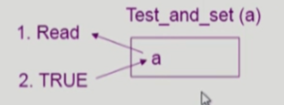
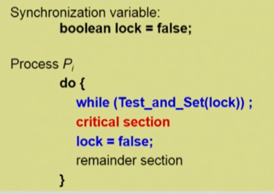
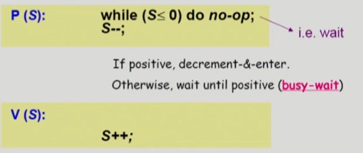
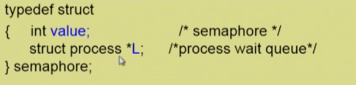
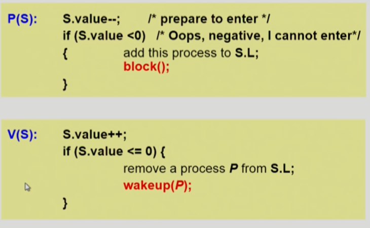
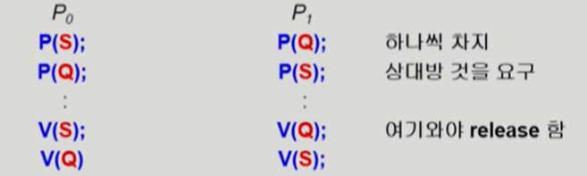
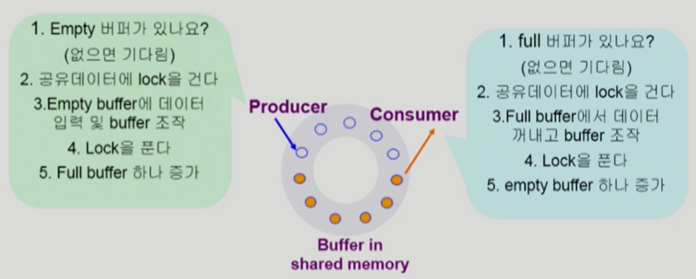
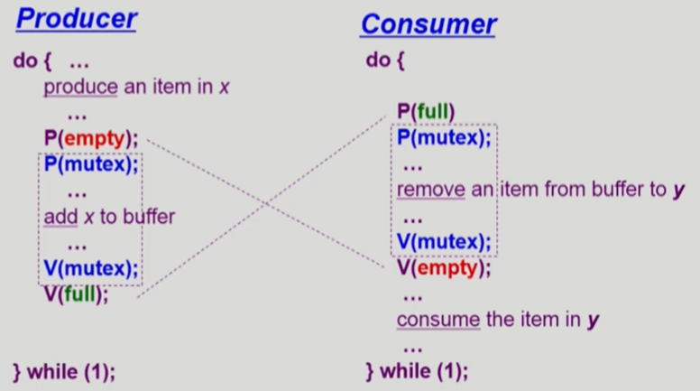
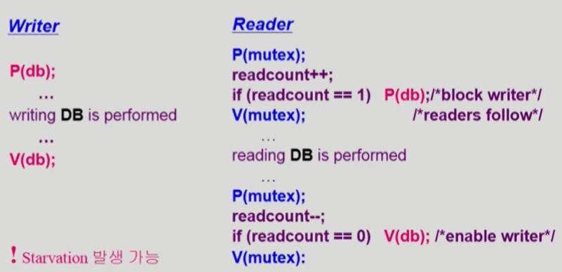
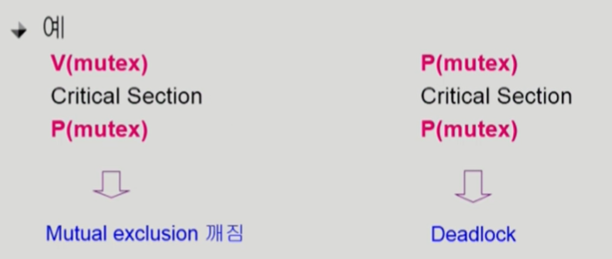

# 💫 Process Synchronization

## ✨ 데이터의 접근


- **Execution-box**

  1. CPU
  2. 컴퓨터내부
  3. 프로세스

- **Storage-box**

  1. Memory
  2. 디스크
  3. 그 프로세스의 주소 공간

  

## ✨ Race Condition


- **S-box(Memory, Address Space)**를 공유하는 **E-box(CPU, Process)**가 여럿 있는 경우 **Race Condition**의 가능성이 있음

- Memory, CPU - Multiprocessor system

- Address Space, Process 

  - 공유메모리를 사용하는 프로세스들
  - 커널 내부 데이터를 접근하는 루틴들 간 (ex : 커널모드 수행 중 인터럽트로 커널모드 다른 루틴 수행 시)

  

### 📢 OS에서 race condition은 언제 발생하는가 ?

1. **kernel 수행 중 인터럽트 발생 시**

   

   - 커널모드 running 중 interrupt가 발생하여 인터럽트 처리루틴이 수행
     - 양쪽 다 커널 코드이므로 kernel address space 공유

2. **Process가 system call을 하여 kernel mode로 수행 중인데 context switch가 일어나는 경우**

   

   - 두 프로세스의 address space 간에는 data sharing이 없음
   - 그러나  system call을 하는 동안에는 kernel address space의 data를 access하게 됨 (share)
   - 이 작업 중간에 CPU를 preempt 해가면 race condition 발생

   

   - 해결책 
     - 커널 모드에서 수행 중일 때는 CPU를 preempt 하지 않음
     - 커널 모드에서 사용자 모드로 돌아갈 때 preempt

3. **Multiprocessor에서 shared memory 내의 kernel data**

   

   - 어떤 CPU가 마지막으로 count를 store 했는가 ? > race condition
   - multiprocessor의 경우 interrupt enable/disable 로 해결되지 않음
   - **방법**
     1. 한번에 하나의 CPU만이 커널에 들어갈 수 있게 하는 방법
     2. 커널 내부에 있는 각 공유 데이터에 접근할 때마다 그 데이터에 대한 lock / unlock을 하는 방법


## ✨ Process Synchronization 문제

- 공유 데이터 (shared data)의 동시 접근 (concurrent access)은 데이터의 불일치 문제(inconsistency)를 발생시킬 수 있다
- 일관성(consistency) 유지를 위해서는 협력 프로세스 (cooperating process) 간의 실행 순서 (orderly execution)를 정해주는 메커니즘 필요
- **Race condition**
  - 여러 프로세스들이 동시에 공유 데이터를 접근하는 상황
  - 데이터의 최종 연산 결과는 마지막에 그 데이터를 다룬 프로세스에 따라 달라짐
- race condition을 막기 위해서는 concurrent process는 동기화 (synchronize) 되어야 한다


## ✨ The Critical-Section Problem

- n개의 프로세스가 공유 데이터를 동시에 사용하기를 원하는 경우
- 각 프로세스의 code segment에는 공유 데이터를 접근하는 코드인 critical section이 존재
- **Problem**
  - 하나의 프로세스가 critical section에 있을 때 다른 모든 프로세스는 critical section에 들어갈 수 없어야 한다.


## ✨ Initial Attempts to Solve Problem

- 두 개의 프로세스가 있다고 가정 P₀, P₁
- 프로세스들의 일반적인 구조


- 프로세스들은 수행의 동기화(synchronize)를 위해 몇몇 변수를 공유할 수 있다 → synchronization variable


## ✨ 프로그램적 해결법의 충족 조건

1. **Mutual Exclusion (상호 배제)**
   - 프로세스 Pi가 critical section 부분을 수행 중이면 다른 모든 프로세스들은 그들의 critical section에 들어가면 안된다
2. **Progress (진행)**
   - 아무도 critical section에 있지 않은 상태에서 critical section에 들어가고자 하는 프로세스가 있으면 critical section에 들어가게 해주어야 한다
3. **Bounded Waiting (유한 대기)**
   - 프로세스가 critical section에 들어가려고 요청한 후부터 그 요청이 허용될 때까지 다른 프로세스들이 critical section에 들어가는 횟수에 한계가 있어야 한다

- 가정
  - 모든 프로세스의 수행 속도는 0보다 크다
  - 프로세스들 간의 상대적인 수행 속도는 가정하지 않는다


### 📢 Algorithm 1

- Synchronization variable

  ```
  int turn;
  initially turn = 0; # Pi can enter its critical section if (turn == i)
  ```

- Process P₀

  

- Satisfies mutual exclusion, but **not progress** >> Progress 조건을 만족하지 못함

- **과잉 양보**

  - 반드시 한번씩 교대로 들어가야만 함 (swap-turn)
  - 그가 turn 을 내값으로 바꿔줘야만 내가 들어갈 수 있음
  - 특정 프로세스가 더 빈번히 critical section을 들어가야 한다면 ?


### 📢 Algorithm 2

- Synchronization variables

  - **boolean flag[2];**

    initially flat [모두] == false /* no one is in CS*/

  - "Pi ready to enter its critical section" if (flag [i] == true)

- Process Pi


- Satisfies mutual exclusion, but **not progress requirement**
- 둘 다 2행까지 수행 후 끊임없이 양보하는 상황 발생 
- 둘 다 깃발만 들었지 기다리다가 못들어감


### 📢 Algorithm 3 ( Peterson's Algorithm )

- Combined synchronization variables of algorithms 1 and 2.
- Process Pi


- Meets all three requirements; solves the critical section problem for two processes.
- **Busy Waiting!**(=spin lock) (계속 CPU와 memory를 쓰면서 wait)


## ✨ Synchronization Hardware

- 하드웨어적으로 **Test & modify** 를 atomic 하게 수행할 수 있도록 지원하는 경우 앞의 문제는 간단히 해결



- Mutual Exclusion with Test & Set

  


## ✨ Semaphores

- 앞의 방식들을 추상화시킴
- **Semaphore S**
  - integer variable
  - 아래의 두 가지 atomic 연산에 의해서만 접근 가능




### 📢 Critical Section of n Processes


- busy-wait 는 효율적이지 못함 (= spin lock)
- Block & Wakeup 방식의 구현 (= sleep lock)
- 

### 📢 Block / Wakeup Implementation

- Semaphore를 다음과 같이 정의



- block 과 wakeup을 다음과 같이 가정
  - **block**
    - 커널은 block을 호출한 프로세스르를 suspend 시킴
    - 이 프로세스의 PCB를 semaphore에 대한 wait queue에 넣음
  - **wakeup(P)**
    - block 된 프로세스 P를 wakeup 시킴
    - 이 프로세스의 PCB를 ready queue로 옮김


#### [ Implementation ] - block / wakeup version of P() & ㅍ()

- Semaphore 연산이 이제 다음과 같이 정의됨



- 자원을 반납하고 끝나는 것이 아니라 혹시 자원을 기다리는 연산이 있다면 그 연산을 깨워줌


### 📢 Which is better ?

- **Busy-wait** v.s. **Block/wakeup**

- **Block/wakeup overhead** v.s. **Critical section** 길이
  - Critical section의 길이가 긴 경우 Block/Wakeup이 적당
  - Critical section의 길이가 매우 짧은 경우 Block/Wakeup 오버헤드가 busy-wait 오버헤드보다 더 커질 수 있음
  - 일반적으로는 Block/Wakeup 방식이 더 좋음


### 📢 Two Types of Semaphores

1. **Counting semaphore**
   - 도메인이 0 이상인 임의의 정수값
   - 주로 resource counting에 사용
2. **Binary semaphore**
   - 0 또는 1 값만 가질 수 있는 semaphore
   - 주로 mutual exclusion (lock/unlock) 에 사용


### 📢 Deadlock and Starvation

- **Deadlock**

  - 둘 이상의 프로세스가 서로 상대방에 의해 충족될 수 있는 event를 무한히 기다리는 현상

- S와 Q가 1로 초기화된 semaphore라 하자.

  

- **Starvation**
  - **indefinite blocking**. 프로세스가 suspend된 이유에 해당하는 세마포어 큐에서 빠져나갈 수 없는 현상

- 자원을 획득하는 순서를 똑같이 맞춰주면 해결할 수 있음


## ✨ Classical Problems of Synchronization

1. Bounded-Buffer Problem (Producer-Consumer Problem)
2. Readers and Writers Problem
3. Dining-Philosophers Problem

### 📢 Bounded-Buffer Problem (Producer-Consumer Problem)



- **Shared data**
  - buffer 자체 및 buffer 조작 변수 (empty / full buffer의 시작 위치)
- **Synchronization variables**
  - mutual exclusion → Need binary semaphore (shared data의 mutual exclusion을 위해)
  - resource count → Need integer semaphore (남은 full/empty buffer의 수 표시)



### 📢 Readers-Writers Problem

- 한 process가 DB에 write 중일 때 다른 process가 접근하면 안됨
- read는 동시에 여럿이 해도 됨
- **solution**
  - Writer가 DB에 접근 허가를 아직 얻지 못한 상태에서는 모든 대기중인 Reader들을 다 DB에 접근하게 해준다
  - Writer는 대기 중인 Reader가 하나도 없을 때 DB 접근이 허용된다
  - 일단 Writer가 DB에 접근중이면 Reader들은 접근이 금지된다
  - Writer가 DB에서 빠져나가야만 Reader의 접근이 허용된다

#### 💡 Shared data

- DB 자체
- readcount
  - 현재 DB에 접근 중인 Reader의 수 

#### 💡 Synchronization variables

- mutex 
  - 공유 변수 readcount를 접근하는 코드(critical section)의 mutual exclusion 보장을 위해 사용
- db
  - Reader와 writer가 공유 DB 자체를 올바르게 접근하게 하는 역할




### 📢 Dining-Philosophers Problem

- **Synchronization variables**

```c
semaphore chopstick[5];
/* Initially all values are 1*/
```

- **Philosopher i**

```c
do{
    P(chopstick[i];)
    P(chopstick[(i+1)%5]);
    ...
    eat();
    ...
    V(chopstick[i]);
    V(chopstick[(i+1)%5]);
    ...
    think();
    ...
} while(1);
```

- 앞의 solution의 문제점
  - Deadlock 가능성이 있다
  - 모든 철학자가 동시에 배가 고파져 왼쪽 젓가락을 집어버린 경우
- 해결방안
  - 4명의 철학자만이 테이블에 동시에 앉을 수 있도록 한다
  - 젓가락을 두 개 모두 집을 수 있을 때에만 젓가락을 집을 수 있게 한다
  - 비대칭
    - 짝수(홀수) 철학자는 왼쪽(오른쪽) 젓가락부터 집도록

#### 💡Monitor

- Semaphore의 문제점
  - 코딩하기 힘들다
  - 정확성(correctness)의 입증이 어렵다
  - 자발적 협력(voluntary cooperation)이 필요하다
  - 한번의 실수가 모든 시스템에 치명적 영향



- 동시 수행중인 프로세스 사이에서 abstract data type의 안전한 공유를 보장하기 위한 high-level synchronization construct

- 모니터 내에서는 한번에 하나의 프로세스만이 활동 가능

- 프로그래머가 동기화 제약 조건을 명시적으로 코딩할 필요없음

- 프로세스가 모니터 안에서 기다릴 수 있도록 하기 위해 condition variable 사용

  `condition x, y;`

- Condition variable은 wait와 signal 연산에 의해서만 접근 가능 

  `x.wait();`

  - `x.wait()` 을 invoke 한 프로세스는 다른 프로세스가 `x.signal()`을 invoke 하기 전까지 suspend 된다

  `x.signal()`

  - `x.signal()` 은 정확하게 하나의 suspend 된 프로세스를 resume 한다.
  - Suspend 된 프로세스가 없으면 아무 일도 일어나지 않는다.