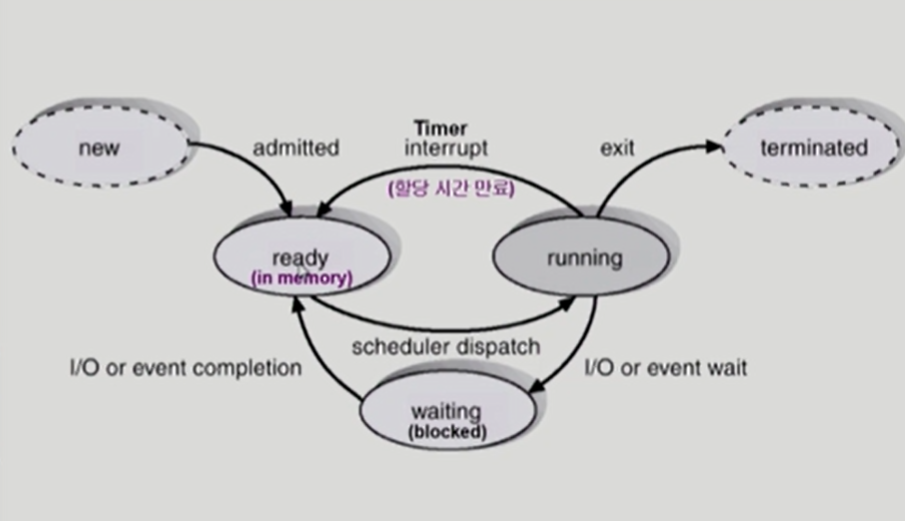
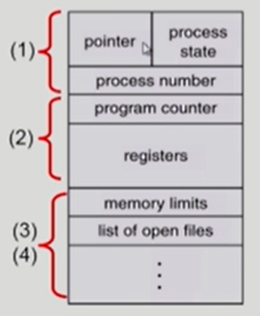
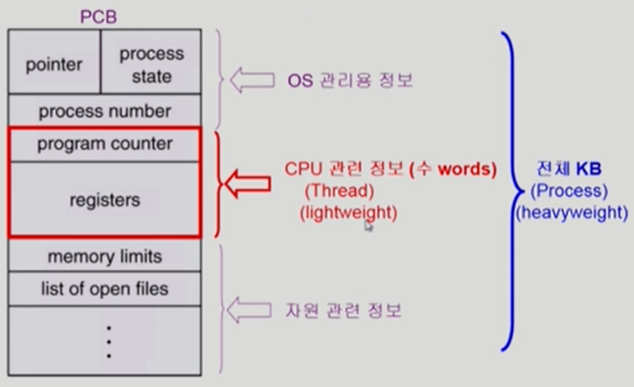

# Process

### ✨ 프로세스의 개념

- Process ia a program in execution

**📢 프로세스의 문맥 (context)**

-  특정 시점을 놓고 보았을때 해당 프로세스가 어디까지 실행했고 어떤 상태인가

-  프로세스가 생성되면 주소를 만들고 CPU가 해당 프로세스 수행 시작

-  어느 시점에 프로세스는 어디까지 와있는가?

-  CPU 수행 상태를 나타내는 하드웨어 문맥 

  - Program Counter - 어딜 가리키고 있는가? (프로세스의 어느 부분인가?)
  - 각종 register - 어떤 instruction까지 실행했는가?

-  프로세스의 주소 공간

  - code, data, stack 에 어떤 내용이 들어있는가 ? 
    - data : queue, PCB

-  프로세스 관련 커널 자료 구조

  - PCB (Process Control Block)
    - Process가 하나 생길 때 마다 운영체제는 PCB는 하나씩 두고 있으면서 CPU, memory를 얼마나 주어야 할지 관리. 
    - 운영체제가 PCB를 어떻게 평가하는지 알아야 함
    - OS에서 프로세스들을 관리하기 위한 자료구조
  - Kernel stack
    - 각 프로세스가 수행 불가능한 작업을 위해 시스템 콜을 할 때 쌓이는 스택
      - 프로세스별로 커널 스택을 따로 둠

-  멀티 태스킹을 위해 프로세스가 변경될 때 문맥을 백업 해두어야 함.

   

### ✨ 프로세스의 상태 (Process State)

**📢 프로세스는 상태(state)가 변경되며 수행된다**

- **Running**
  - CPU를 잡고 instruction을 수행중인 상태
- **Ready**
  - CPU를 기다리는 상태(메모리 등 다른 조건을 모두 만족하고)
  - 물리적인 메모리에 올라와 있는 상태. CPU만 얻으면 되는 상태
- **Blocked (wait, sleep)**
  - CPU를 주어도 당장 instruction을 수행할 수 없는 상태
  - Process 자신이 요청한 event(예: I/O)가 즉시 만족되지 않아 이를 기다리는 상태
  - 예 ) 디스크에서 file을 읽어와야 하는 경우
- **Suspended (stopped)**
  - 외부적인 이유(중기 스케줄러, 사용자 etc)로 프로세스의 수행이 정지된 상태
  - 프로세스는 통째로 디스크에 swop out 된다.
  - ex) 사용자가 프로그램을 일시 정지 시킨 경우 사용자가 다시 재개할 때까지 Active한 상태가 될 수 없음

- **New**
  - 프로세스가 생성중인 상태
- **Terminated** 
  - 수행(excution)이 끝난 상태 (아직 프로세스는 kill 되지 않음)

​    

### ✨ Process Control Block (PCB)

- 운영체제가 각 프로세스를 관리하기 위해 프로세스당 유지하는 정보

- 다음의 구성 요소를 가진다. (구조체로 유지)

  

(1) OS가 관리상 사용하는 정보

- Process state, Process ID
- scheduiling information, Priority

(2) CPU 수행 관련 하드웨어 값

- Program counter, registers

(3) 메모리 관련

- Code, data, stack의 위치 정보 

(4) 파일 관련

- Open file descriptros .. 

### ✨ 문맥 교환 (Context Switch)

- CPU를 한 프로세스에서 다른 프로세스로 넘겨주는 과정
- CPU가 다른 프로세스에게 넘어갈 때 운영체제는 다음을 수행 (메모리 커널에서 수행)
  - CPU를 내어주는 프로세스의 상태를 그 프로세스의 PCB에 저장
  - CPU를 새롭게 얻는 프로세스의 상태를 PCB에서 읽어옴

- System call이나 (하드웨어) Interrupt 발생시 반드시 context switch가 일어나는 것은 아님
  - not context swtich: process A → OS → process A
    - 이때도 CPU 수행 정보 등 context의 일부를 PCB에 save해야 하지만 Overhead가 적음
  - context switch: process A → process B
    - 캐시 메모리 모두 지움(flush) → 큰 Overhead
  - 사용자 프로세스로부터 CPU가 프로세스로 넘어가는 것을 context switch라고 하지 않음 

### ✨ 프로세스를 스케줄링하기 위한 큐

- **Job queue**
  - 현재 시스템 내에 있는 모든 프로세스의 집합
- **Ready queue**
  - 현재 메모리 내에 있으면서 CPU를 잡아서 실행되기를 기다리는 프로세스의 집합
- **Device queues**
  - I/O device의 처리를 기다리는 프로세스의 집합
- 프로세스들은 각 큐들을 오가며 수행된다.

### ✨ 스케줄러 (Scheduler)

- **Long-term Scheduler (장기 스케줄러 or job scheduler)**
  - 시작 프로세스 중 어떤 것들을 ready queue로 보낼 지 결정
  - 프로세스에 **memory (및 각종 자원)**을 주는 문제
    - 시작될 때, 메모리에 올라가는 것을 admit
  - **degree of Multiprogramming**을 제어
    - 메모리에 올라가 있는 프로세스의 수를 제어
  - time sharing system 에는 보통 장기 스케줄러가 없음 (무조건 ready)
- **Short-term Scheduler (단기 스케줄러 or CPU scheduler)**
  - 어떤 프로세스를 다음번에 running 시킬지 결정 
  - 프로세스에 **CPU**를 주는 문제
  - 충분히 빨라야 함 (millisecond 단위)
- **Medium-term Scheduler (중기 스케줄러 or Swapper)**
  - **여유 공간 마련을 위해 프로세스를 통째로 메모리에서 디스크로 쫓아냄**
  - 프로세스에게서 memory를 뺏는 문제
  - degree of MultiProgramming을 제어

### ✨ Thread

**"A thread (or lightweight process) is a basic unit of CPU utilization"**

- Process 내부에 CPU 수행단위가 여러개 있는 것

**📢 Thread의 구성**

- program counter
- register set
- stack space

**📢 Thread가 동료 thread와 공유하는 부분 (=task)**

- code section
- data section
- OS resources

**📢 전통적인 개념의 heavyweight process는 하나의 thread를 가지고 있는 task로 볼 수 있다**.

**📢 장점**

- 다중 thread로 구성된 태스크 구조에서는 하나의 서버 thread가 blocked (waiting) 상태인 동안에도 동일한  task 내의 다른 thread가 실행(running) 되어 빠른 처리를 할 수 있다.
- 동일한 일을 수행하는 다중 thread가 협력하여 높은 처리율 (throughput)과 성능 향상을 얻을 수 있다.
- thread를 사용하면 병렬성을 높일 수 있다.
- **Responsiveness**
  - ex) multi-threaded Web - if one thread is blocked (ex. network), another thread continues (ex. display)
- **Resourece Sharing**
  - n threads can share binary code, data, resource of the process
- **Economy**
  - creating & CPU switching **thread** (rather than a **process**)
  - Solaris의 경우 위 두 가지 overhead가 각각 30배, 5배
- **Utilization of MP Architectures**
  - each thread may be running in **parallel** on a different processor

### ✨ Implementation of Threads

**📢 Some are supported by kernal > kenel Threads**

- Windows 95/98/NT
- Solaris
- Digital UNIX, Mach

**📢Others are supported by library > User Threads**

- POSIX Pthreads
- Mach C-threads
- Solaris threads

**📢 Some are real-time threads**

# ❤️ 질문

### ✨ Question

1. 프로세스와 스레드의 차이를 설명해보세요.
2. 동기식 입출려과 비동기식 입출력의 차이에 대해 설명해보세요.

### ✨ Answer

1. 
2. 

