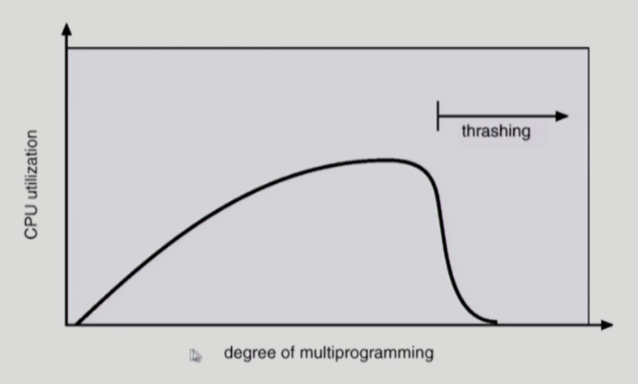
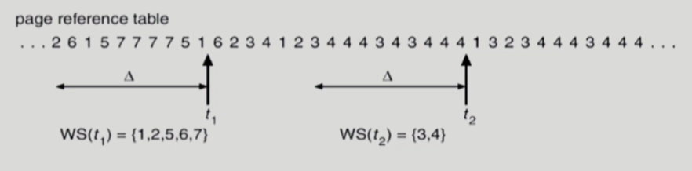
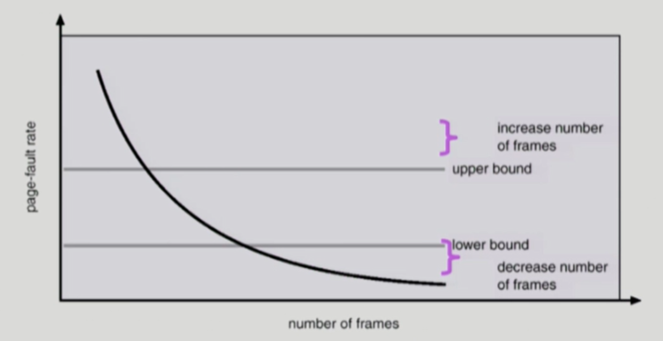

# 💫 Virtual Memory

- 물리적인 메모리의 주소 변화는 운영 체제가 관여하지 않지만 가상 메모리 기법은 전적으로 운영체제가 관여하고 있다.
- Paging 기법을 사용하는 것으로 가정

## ✨ Demand Paging

- 실제로 필요할 때 page를 메모리에 올리는 것

  - I/O 양의 감소
  - Memory 사용량 감소
  - 빠른 응답 시간
  - 더 많은 사용자 수용

- Valid / Invalid bit의 사용

  - Invalid 의 의미

    - 사용되지 않는 주소 영역인 경우
    - 페이지가 물리적 메모리에 없는 경우

  - 처음에는 모든 page entry가 invalid로 초기화

  - Address translation 시에 invalid bit이 set 되어 있으면

    → **page fault** 

### 📌 Memory에 없는 Page의 Page Table

### 📌 Page Fault

- invalid page 를 접근하면 MMU(주소전환을 해주는 하드웨어) 가 trap을 발생시킴 (page fault trap)
- Kernel mode 로 들어가서 page fault handler 가 invoke 됨
- 다음과 같은 순서로 page fault를 처리한다
  1. Invalid reference? (ex. bad address, protection viloation) → abort process.
  2. Get an empty page frame. (없으면 뺏어온다 : replace)
  3. 해당 페이지를 disk에서 memory로 읽어온다
     1. disk I/O가 끝나기까지 이 프로세스는 CPU를 preempt 당함 (block)
     2. Dist read가 끝나면 page tables entry 기록, valid/invalid bit = "valid"
     3. ready queue에 process를 insert → dispatch later
  4. 이 프로세스가 CPU를 잡고 다시 running
  5. 아까 중단되었던 instruction을 재개

### 📌 Steps in Handling a Page Fault

### 📌 Performance of Demand Paging

- Page Fault Rate 0 <= p <= 1.0

  - if p = 0 no page faults
  - if p = 1, every reference is a fault

- Effective Access Time

  = (1 - p) x memory access

  +p (OS & HW page fault averhead
  +[swap page out if needed]
  +swap page in
  +OS & HW restart overhead)

### 📌 Free frame이 없는 경우

- **Page replacement**

  - 어떤 frame을 빼앗아올지 결정해야 함
  - 곧바로 사용되지 않을 page 를 쫓아내는 것이 좋음
  - 동일한 페이지가 여러 번 메모리에서 쫓겨났다가 다시 들어올 수 있음

- **Replacemetn Algorithm**

  - page-fault rate 를 최소화하는 것이 목표

  - 알고리즘의 평가

    - 주어진 page reference string에 대해 page fault를 얼마나 내는지 조사

  - reference string의 예

    1, 2, 3, 4, 1, 2, 5, 1, 2, 3, 4, 5.

### 📌 Page Replacement

### 📌 Optimal Algorithm

- MIN (OPT) : 가장 먼 미래에 참조되는 page 를 replace

- **4 frames example**

  

- 미래의 참조를 어떻게 아는가?
  - Offline algorithm
- 다른 알고리즘의 성능에 대한 uppter bound 제공
  - Belady's optimal algorithm, MIN, OPT 등으로 불림

### 📌 FIFO (First In Fisrt Out) Algorithm

### 📌 LRU (Least Recently Used) Algorithm

### 📌 LFU (Least Frequently User) Algorithm

- LFU : 참조 횟수 (reference count) 가 가장 적은 페이지를 지움
  - 최저 참조 횟수인 page가 여럿 있는 경우
    - LFU 알고리즘 자체에서는 여러 page 중 임의로 선정한다
    - 성능 향상을 위해 가장 오래 전에 참조된 page를 지우게 구현할 수도 있다
  - 장단점
    - LRU 처럼 직전 참조 시점만 보는 것이 아니라 장기적인 시간 규모를 보기 때문에 page의 인기도를 좀 더 정확히 반영할 수 있음
    - 참조 시점의 최근성을 반영하지 못함
    - LRU 보다 구현이 복잡함

### 📌 LRU와 LFU 알고리즘 예제

### 📌 LRU와 LFU 알고리즘의 구현

### 📌 다양한 캐슁 환경

- 캐슁 기법
  - 한정된 빠른 공간(=캐쉬)에 요청된 데이터를 저장해 두었다가 후속 요청시 캐쉬로부터 직접 서비스하는 방식
  - paging system 외에도 cache memory, buffer caching, Web caching 등 다양한 분야에서 사용
- 캐쉬 운영의 시간 제약
  - 교체 알고리즘에서 삭제할 항목을 결정하는 일에 지나치게 많은 시간이 걸리는 경우 실제 시스템에서 사용할 수 없음
  - Buffer caching 이나 Web caching 의 경우
    - O(1) 에서 O(log n) 정도까지 허용
  - Paging system 인 경우
    - page fault 인 경우에만 OS가 관여함
    - 페이지가 이미 메모리에 존재하는 경우 참조시각 등의 정보를 OS가 알 수 없음
    - O(1)인 LRU의 list 조작조차 불가능

### 📌 Clock Algorithm

- **Clock algorithm**
  - LRU의 근사(approximation) 알고리즘
  - 여러 명칭으로 불림
    - Second chance algorithm
    - NUR (Not Used Recently) 또는 NRU(Not Recently Used)
  - Reference bit을 사용해서 교체 대상 페이지 선정 (circular list)
  - reference bit 가 0인 것을 찾을 때까지 포인터를 하나씩 앞으로 이동
  - 포인터 이동하는 중에 reference bit 1은 모두 0으로 바꿈
  - Reference bit 이 0 인 것을 찾으면 그 페이지를 교체
  - 한 바퀴 되돌아와서도(=second chance) 0 이면 그 때에는 replace 당함
  - 자주 사용되는 페이지라면 second chance가 올 때 1
- Clock algorithm 의 개선
  - reference bit 과 modified bit (dirty bit) 을 함께 사용
  - referenct bit = 1 : 최근에 참조된 페이지
  - modified bit = 1 : 최근에 변경된 페이지 (I/O를 동반하는 페이지)

### 📌 Page Frame의 Allocation

- Allocation problem : 각 process에 얼마만큼의 page frame을 할당할 것인가 ?
- Allocation의 필요성
  - 메모리 참조 명령어 수행시 명령어, 데이터 등 여러 페이지 동시 참조
    - 명령어 수행을 위해 최소한 할당되어야 하는 frame의 수가 있음
  - Loop를 구성하는 page 들은 한꺼번에 allocate 되는 것이 유리함
    - 최소한의 allocation이 없으면 매 loop 마다 page fault
- Allocation Scheme
  - **Eqaul allcation** : 모든 프로세스에 똑같은 갯수 할당
  - **Proportional allocation** : 프로세스 크기에 비례하여 할당
  - **Priority allocation** : 프로세스의 priority에 따라 다르게 할당

### 📌 Global vs. Local Replacement

- **Global replacement**
  - Replace  시 다른 process에 할당된 frame을 빼앗아 올 수 있다
  - Process 별 할당량을 조절하는 또 다른 방법임
  - FIFO, LRU, LFU 등의 알고리즘을 global replacement로 사용시에 해당
  - Working set, PFF 알고리즘 사용
- **Local replacement**
  - 자신에게 할당된 frame 내에서만 replacement
  - FIFO, LRU, LFU 등의 알고리즘을 process 별로 운영시

### 📌 Thrashing

- 프로세스의 원활한 수행에 필요한 최소한의 page frame 수를 할당 받지 못한 경우 발생
- Page fault rate이 매우 높아짐
- CPU utilization 이 낮아짐
- OS 는 MPD (Multiprogramming degree) 를 높여야 한다고 판단
- 또 다른 프로세스가 시스템에 추가됨 (higher MPD)
- 프로세스 당 할당된 frame의 수가 더욱 감소
- 프로세스는 page의 swap in / swap out 으로 매우 바쁨
- 대부분의 시간에 CPU는 한가함
- low throughput

### 📌 Working-Set Model

- Locality of reference
  - 프로세스는 특정 시간 동안 일정 장소만을 집중적으로 참조한다
  - 집중적으로 참조되는 해당 page들의 집합을 locality set이라 함
- Working-set Model
  - Locality 에 기반하여 프로세스가 일정 시간 동안 원활하게 수행되기 위해 한꺼번에 메모리에 올라와 있어야 하는 page들의 집합을 Working Set이라 정의함
  - Working Set 모델에서는 process 의 working set 전체가 메모리에 올라와 있어야 수행되고 그렇지 않을 경우 모든 frame을 반납한 후 swap out (suspend)
  - Thrashing을 방지함
  - Multiprogramming degree를 결정함

### 📌 Working-Set Algorithm

- Working Set의 결정
  - Working set window를 통해 알아냄
  - window size가 ∆인 경우
    - 시각 ti 에서의 working set WS (ti)
      - Time interval [ti-∆, ti] 사이에 참조된 서로 다른 페이지들의 집합
    - Working set에 속한 page는 메모리에 유지, 속하지 않은 것은 버림
      (즉, 참조된 후 ∆ 시간 동안 해당 page를 메모리에 유지한 후 버림)

- Working-Set Algorithm

  - Process 들의 working set size의 합이 page frame 의 수보다 큰 경우
    - 일부 process 를 swap out 시켜 남은 process 의 working set을 우선적으로 충족시켜 준다 (MPD를 줄임)

  - Working set을 다 할당하고도 page frame이 남는 경우
    - Swap out 되었던 프로세스에게 working set을 할당 (MPD를 키움)

- Window size ∆

  - Working set을 제대로 탐지하기 위해서는 window size를 잘 결정해야 함
  - ∆ 값이 너무 작으면 locality set을 모두 수용하지 못할 우려
  - ∆ 값이 크면 여러 규모의 locality set 수용
  - ∆ 값이 infinite 이면 전체 프로그램을 구성하는 page를 working set 으로 간주

### 📌 PFF (Page-Fault Frequency) Scheme

- page-fault rate의 상한값과 하한값을 둔다
  - Page fault rate 이 상한값을 넘으면 frame을 더 할당한다
  - Page fault rate이 하한값 이하이면 할당 frame 수를 줄인다
- 빈 frame이 없으면 일부 프로세스를 swap out

### 📌Page Size 의 결정

- Page size를 감소시키면
  - 페이지 수 증가
  - 페이지 테이블 크기 증가
  - Internal fragmentation 감소
  - Disk transfer 의 효율성 감소
    - Seek/rotation vs. transfer
  - 필요한 정보만 메모리에 올라와 메모리 이용이 효율적
    - Locality의 활용 측면에서는 좋지 않음
- Trend
  - Larger page size